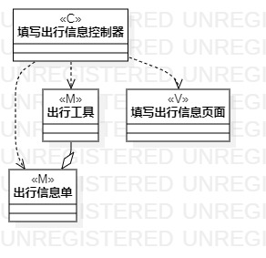
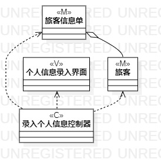
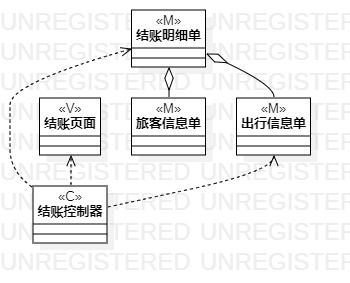

# 实验四:类建模
# 实验五:高级类建模

## 一、实验目标
1. 掌握类的概念和构成
2. 掌握类建模方法
3. 了解MVC设计模式
4. 理解类的5种关系
5. 掌握类之间关系的画法

## 二、实验内容
- 根据用例规约绘制相应的类图。

   1.填写出行信息类图

   2.录入个人信息类图

   3.结账类图
   
## 三、实验步骤
1. 在例规约中利用MVC模式寻找类
2. 确定类与类之间的关系
3. 在StarUML中画出类图

## 四、实验结果

图1：填写出行信息类图  

图2：录入个人信类图  

图2：结账类图  
