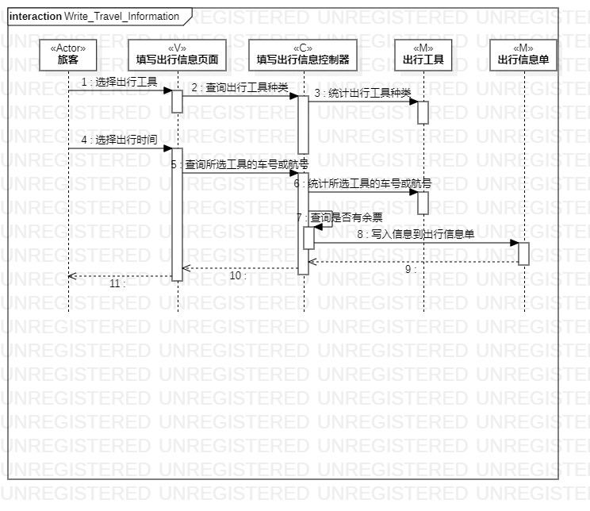
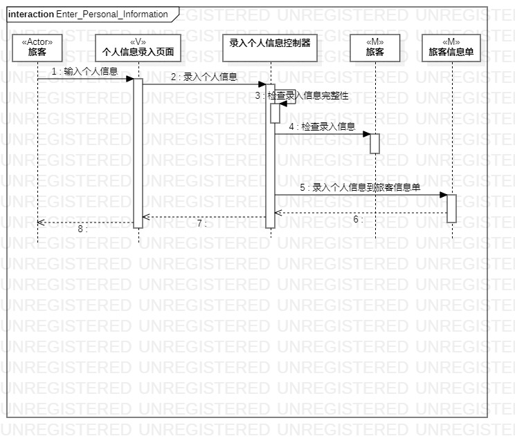
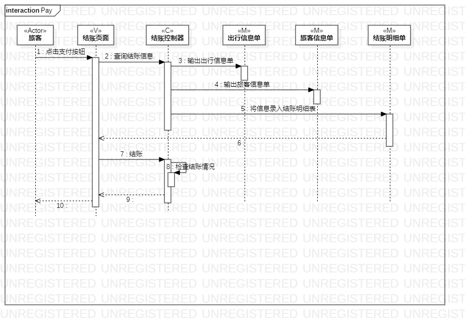

# 实验六：交互类建模

## 一、实验目标

1. 理解系统交互。 

2. 掌握UML顺序图的画法。 

3. 掌握对象交互的定义与建模方法。 

## 二、实验内容

1. 根据用例模型和类模型，确定功能所涉及的系统对象。  

2. 在顺序图上画出参与者（对象）。  

3. 在顺序图上画出消息（交互）。 

## 三、实验步骤

1. 打开StarUML

2. 根据用例图和类图确定参与者，添加Lifeline  

3. 根据活动图，添加message  

4. 根据活动图，添加Reply Message  

## 四、实验结果

  
图1：填写出行信息顺序图

  
图2：录入个人信顺序图  

  
图3：结账顺序图  
