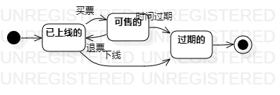

# 实验七：状态建模

## 1. 实验目标

1. 掌握对象状态建模（状态图，Statechart）

## 2. 实验内容

1. 学习状态建模和状态图概念
2. 学习状态图画法
3. 画1个重要对象的状态图

## 3. 实验步骤

1. 寻找1个重要的对象
2. 寻找这个对象所有重要的状态
3. 画出状态之间的转变条件 
4. 用UML画出该对象的状态图
5. 写lab7.md

## 4. 实验结果

图1：票的状态图
