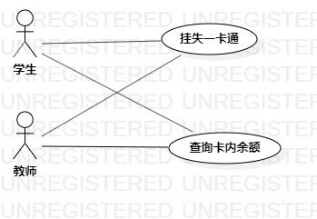

# 实验二：用例建模

## 1. 实验目标

- 使用Markdown编写实验报告
- 选题并用例建模

## 2. 实验内容

- 创建用例图
- 编写实验报告文档

## 3. 实验步骤

- 确定选题：校园一卡通管理系统
  功能：
  （1）挂失一卡通
  （2）查询卡内余额
- 在StartUML上创建用例图
- 创建两个Actor：教师和学生
- 创建两个UseCase：挂失一卡通、查询卡内余额
- 建立Actor与UseCase的关系
- 编写用例规约

## 4. 实验结果

  
图1：校园一卡通管理系统的用例图

## 表1：挂失一卡通用例规约  

用例编号  | UC01 | 备注  
-|:-|-  
用例名称  | 挂失一卡通 |   
前置条件  |      | *可选*   
后置条件  |      | *可选*   
基本流程  | 1. 教师或学生点击挂失一卡通按钮；  |*用例执行成功的步骤*    
~| 2. 系统显示挂失界面；  |   
~| 3. 教师或学生输入账号（学号或工号），点击确定挂失按钮；  |   
~| 4. 系统查询账号存在；  |
~| 5. 系统修改一卡通账号状态为“挂失”；  |
~| 6. 系统返回“挂失成功”提示信息。  |
扩展流程  | 4.1 系统检查发现账号不存在，返回“该账号不存在，请重新输入”提示信息。  |*用例执行失败*    

## 表2：查询卡内余额用例规约  

用例编号  | UC02 | 备注  
-|:-|-  
用例名称  | 查询卡内余额 |   
前置条件  |      | *可选*   
后置条件  |      | *可选*   
基本流程  | 1. 教师或学生点击查询卡内余额按钮；  |*用例执行成功的步骤*    
~| 2. 系统显示查询界面；  |   
~| 3. 教师或学生输入账号（学号或工号），点击开始查询按钮；  |   
~| 4. 系统查询账号存在；  |   
~| 5. 系统返回卡内余额。  |  
扩展流程  | 4.1 系统检查发现账号不存在，返回“该账号不存在，请重新输入”提示信息。  |*用例执行失败*    
