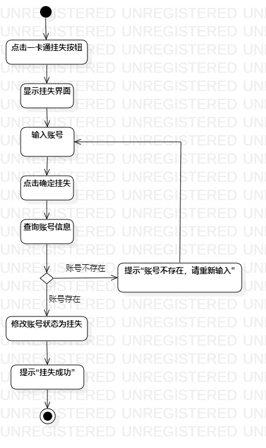
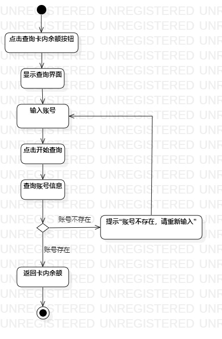

# 实验三:过程建模

## 一、实验目标
- 掌握过程建模。
- 绘制活动图（Activity Diagram）。

## 二、实验内容
- 绘制与用例规约相对应的活动图。

## 三、实验步骤
根据实验二制定的用例规约，绘制挂失一卡通活动图和查询卡内余额活动图。

  1.添加开始(Initial)节点；
  
  2.添加结束(Final)节点；
  
  3.把基本流程和扩展流程的动作画为操作（Action）节点；
  
  4.分支的操作之后使用决策（Decision）节点。
  
## 四、实验结果
  
图1 挂失一卡通活动图

  
图2 查询卡内余额活动图

## 五、实验总结
通过本次实验的学习，我了解了uml活动图的概念，更加明白写好用例规约的重要性，学到了如何在用例规约的基础上画活动图。
