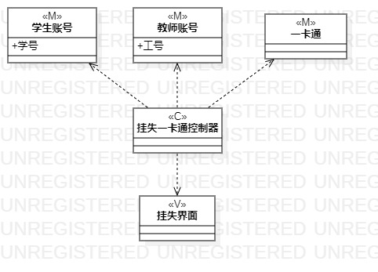
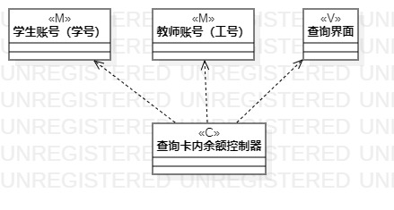

# 实验四五

## 一、实验目标

1. 掌握类建模方法；
2. 了解MVC设计模式；
3. 掌握类图的画法。（Class Diagram）

## 二、实验内容

1. 基于MVC模式设计类；
2. 设计类的关系；
3. 画出类图。

## 三、实验步骤

1. 确定设计模式，这里选择MVC模式。 
2. 在StartUML中绘制类图  
   （1）确定模型层(Model)：根据用例涉及的数据设计模型类；  
   （2）确定控制器层(Controller)：根据用例中实现界面与数据层之间交互的方法设计控制器类；  
   （3）确定视图层(View)：根据用例中涉及到的界面设计界面类。   
3. 根据mvc模式确定类的关系。 

## 四、实验结果
  
图1.挂失一卡通类图

   
图2.查询卡内余额类图
