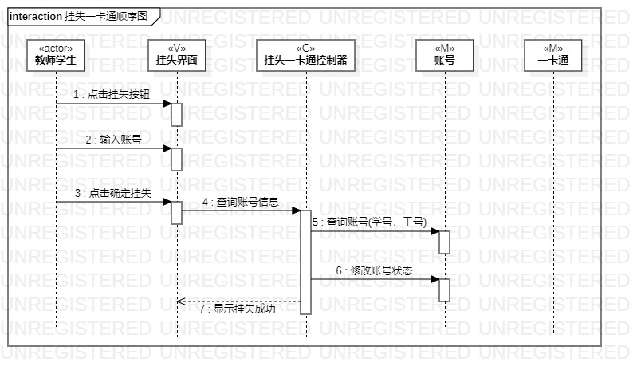
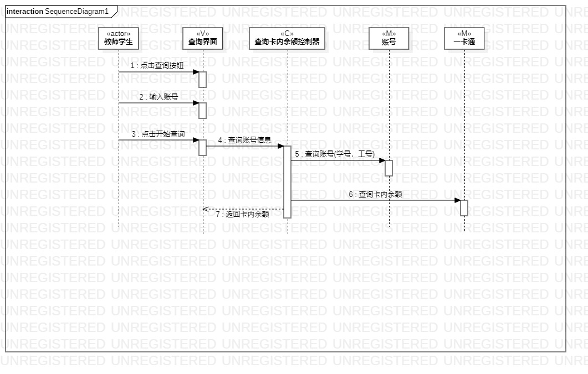

# 实验六：交互建模

## 一、实验目标

1. 理解系统交互。 

2. 掌握UML顺序图的画法。 

3. 掌握对象交互的定义与建模方法。 

## 二、实验内容

1. 根据用例模型和类模型，确定功能所涉及的系统对象。  

2. 在顺序图上画出参与者。  

3. 在顺序图上画出消息。 

## 三、实验步骤

1. 在StarUML画顺序图  

2. 根据实验二、实验四五类建模确定对象，添加Lifeline  

3. 根据实验三过程建模确定消息，添加message  

4. 根据实验三过程建模确定返回消息，添加Reply Message  

## 四、实验结果

  
图1：挂失一卡通顺序图

  
图2：查询卡内余额顺序图 
