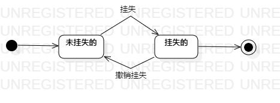

# 实验七：状态建模

## 一、实验目标

1. 掌握对象状态建模（状态图，Statechart）；
2. 掌握状态图的画法（Statechart Diagram）。

## 二、实验内容

1. 学习对象的状态的概念；
2. 学习状态图的画法；
3. 找出自己系统中的一个关键对象，绘制该对象的状态图。

## 三、实验步骤

1. 从系统中找出一个关键对象：一卡通；
2. 确定一卡通的关键状态：  
   （1）挂失的  
   （2）未挂失的   
3. 设计上述状态之间的转变条件； 
4. 用StarUML画出该对象的状态图（StatechartDiagram）。

## 四、实验结果

   
图1：一卡通的状态图
