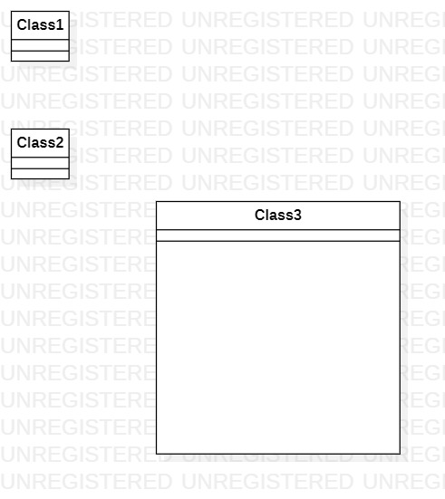

# 实验一

## 一、实验目标

1. 熟悉GitHub实验过程
2. 安装与使用StarUML

## 二、实验内容

1. 安装GitHub并练习使用GitBash
2. 安装StarUML并创建一个图

## 三、实验步骤

1. 在Github官网下载Github客户端并安装
2. 将老师课程项目克隆到自己账号仓库
3. 将自己账号仓库克隆到本地
4. 在自己电脑完成实验并push到自己账号仓库
5. 将项目Pull requests到老师项目仓库

## 四、实验结果

1. 画图

1714080902631

图1. 在StarUML创建的第一个图
