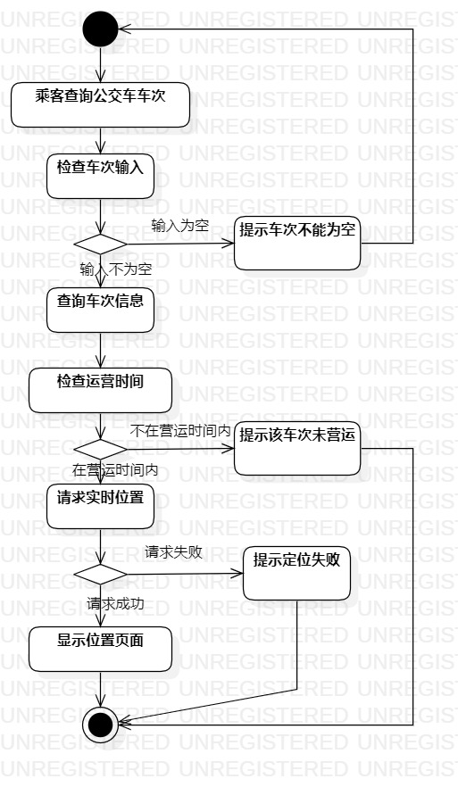
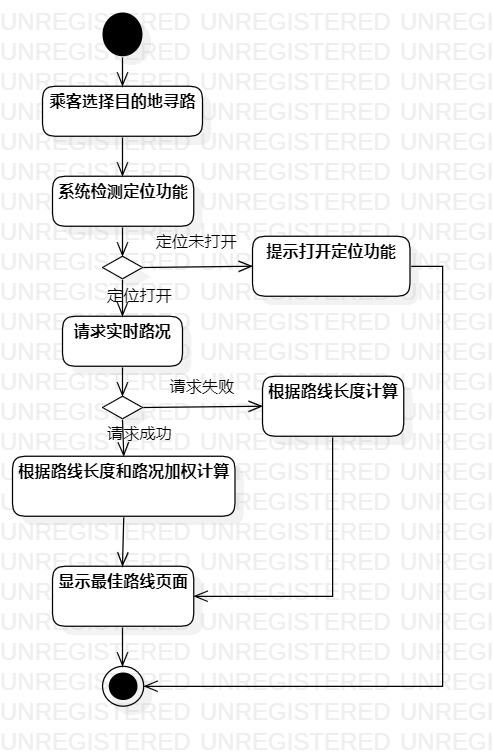

# 实验三：过程建模

## 一、 实验目标

1. 掌握过程建模方法；
2. 掌握活动图的画法。

## 二、 实验内容

根据用例规约绘制活动图

## 三、 实验步骤

1. 选择初始结点Initial和结束结点Final
2. 根据用例规约中的基本流程和扩展流程添加操作Action
3. 在分支操作处添加决策结点Decision，标明判决条件
4. 按流程连接各个元素
5. 绘制活动图

## 4. 实验结果

  

图1：查询公交车的活动图

  

图2：寻找路线的活动图
