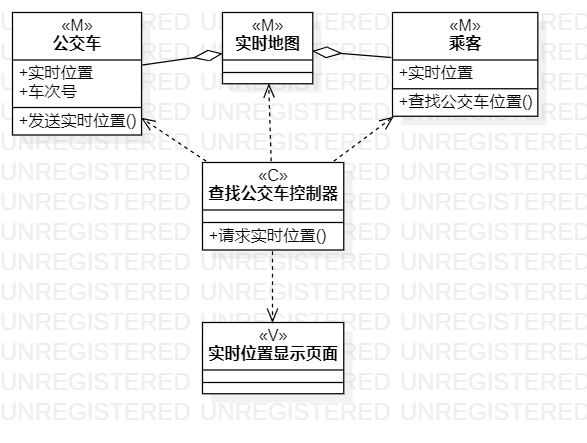
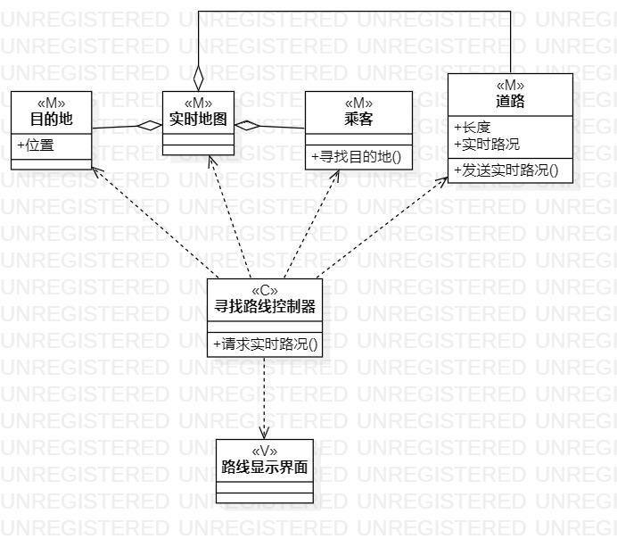

# 实验四五：类建模

## 一、 实验目标

1. 掌握类建模；
2. 了解MVC或你熟悉的设计模式；
3.掌握类图的画法（Class Diagram）

## 二、 实验内容

1.基于MVC模式设计类
2.设计类的关系
3.画出类图

## 三、 实验步骤

1. 创建查找公交车的类图项目
2. 根据用例规约创建公交车类，实时地图类，查找公交车控制器类，实时位置显示页面类
3. 用依赖线连接查找公交车控制器类和其他类，使用聚合线连接公交车类，实时地图类
4. 创建寻找路线的类图项目
5. 根据用例规约创建实时地图类，乘客类，道路类，寻找路线控制器类，路线显示界面类
6. 用依赖线连接寻找路线控制器类图和其他类，使用聚合线连接实时地图类，乘客类，道路类

## 四、 实验结果

  

图1：查询公交车的类图

  

图2：寻找路线的类图
