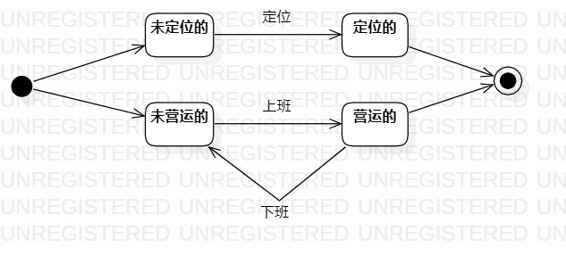

# 实验七：状态建模

## 一、 实验目标

1. 掌握对象状态建模（状态图，Statechart）。

## 二、 实验内容

1.根据活动图和类图，确定功能所涉及的系统对象；

2.在顺序图上画出参与者；

3.在顺序图上画出消息。

## 三、 实验步骤

1.寻找一个关键的对象公交车；

2.设计该对象的关键状态（未定位，定位的，未营运的，营运的）；

3.设计状态之间的转变条件（定位，上班，下班）。

## 四、 实验结果

  

图1：实时地图的状态图
