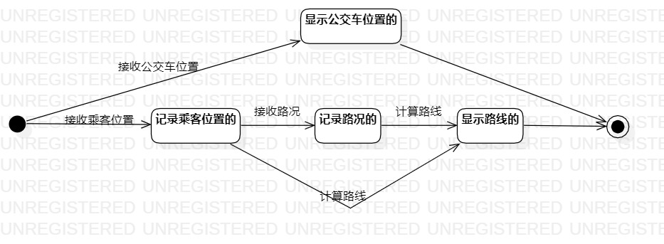

# 实验七：状态建模

## 一、 实验目标

1. 掌握对象状态建模（状态图，Statechart）。

## 二、 实验内容

1.根据活动图和类图，确定功能所涉及的系统对象；

2.在顺序图上画出参与者；

3.在顺序图上画出消息。

## 三、 实验步骤

1.寻找一个关键的对象实时地图；

2.设计该对象的关键状态（显示公交车位置的、记录乘客位置的、记录路况的、显示路线的）；

3.设计状态之间的转变条件（接收公交车位置、接收乘客位置、接收路况、计算路线）。

## 四、 实验结果

  

图1：实时地图的状态图
