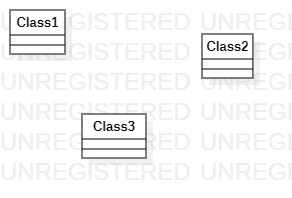

# 实验一：UML建模工具

## 一、实验目标

1.熟悉GitHub实验过程  
2.安装与使用StarUML  

## 二、实验内容

1.安装Github并练习使用Git Bash  
2.安装StarUML并创建一个图  
3.提交实验报告  

## 三、实验步骤

1.安装StarUML（下载地址http://staruml.io ）   
2.安装64位的Git工具（下载地址http://git-scm.org ）  
3.注册并登陆Github账号（https://github.com ）  
4.打开 https://github.com/hzuapps/uml-modeling-2020 ，点击Fork按钮，将项目复制到个人账号下  
5.打开Git Bash，使用cd命令进入F盘，clone命令将个人库的项目复制到本地磁盘  
6.使用mkdir命令创建目录“1714080902632”，使用touch命令创建Markdown文件lab1.md  
7.使用git add 文件名，git commit -m "文件内容"，git push命令提交代码到个人库上  
8.在个人库上点击“New pull request”按钮发送合并请求  
9.打开StarUML工具，按照视频创建第一个StarUML图  
10.将创建的图发送到个人库中（若未被关闭，则其在 https://github.com/hzuapps/uml-modeling-2020 所提交的项目上也会更新）  
11.检查有无改错文件   

## 四、实验结果

1.画图

图1.在StarUML上创建的第一个图
