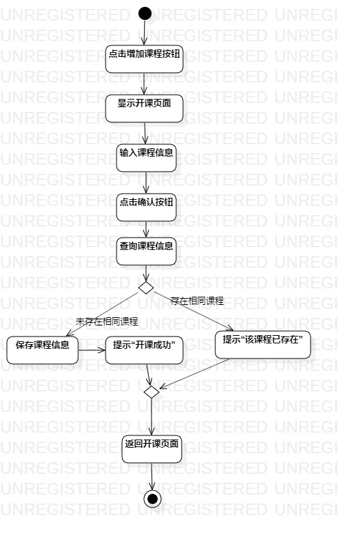
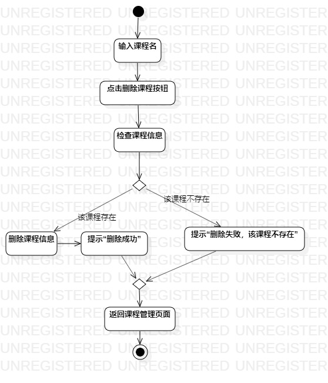

# 实验三：过程建模

## 一、实验目标  
- 1.掌握过程建模方法  
- 2.掌握活动图的画法（Activity Diagram）  

## 二、实验内容  
- 1.学习活动图画法  
- 2.根据实验2所得用例图，使用StarUML画出活动图    
- 3.编写实验报告   

## 三、实验步骤  
- 1.观看实验3相关视频  
- 2.查看自己实验2的用例规约并作出修改  
- 3.打开StarUML model新建Activity Diagram  
- 4.根据用例规约画活动图  
    添加Initial  
    按基本流程添加Action  
    添加Decision  
    按基本流程和扩展流程添加Action  
    添加Final  
    添加Control Flow    
- 5.git pull到本地库  
- 6.git push到个人库  
- 7.编写实验报告  

## 四、实验结果  

图1：开设课程活动图  

   

图2：删除课程活动图  

## 五、实验总结
- 画图要工整  
- 要根据用例规约画图，及时更改用例规约  
