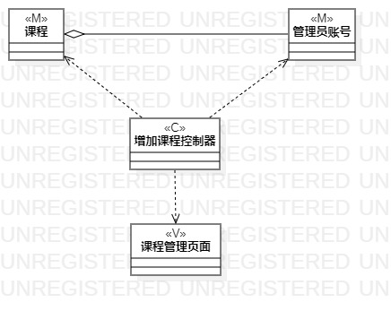
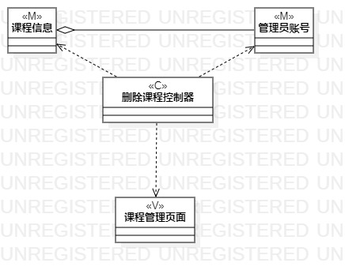

# 实验四五：类建模  

## 1. 实验目标  

1. 了解类图概念  
2. 了解MVC模式  
3. 掌握类图画法  
4. 了解UML类图的5种关系  
5. 掌握类建模方法  

## 2. 实验内容  

1. 学习类图概念    
   - 类与类  
   - 类与关系  
2. 学习类图画法    
3. 画用例类图  

## 3. 实验步骤  

1. 观看实验四五相关视频   
2. 根据MVC模式观察用例的模型、视图、控制器  
3. 打开StarUML model新建Class Diagran  
4. StarUML画类图  
   - 按模型添加Class  
   - 添加控制器Class  
   - 添加界面Class  
   - 按MVC模式建立Dependency  
   - 建立Aggregation  
5. git add、git commit、git push到个人库  
6. 编写lab45.md  

## 4.实验结果  

  

图1：开设课程类图  

  

图2：删除课程类图  

## 5.课堂笔记  

1. 类：属性与操作  
2. 类图的5种关系（从弱到强）  
   - 依赖(Dependency):一个类使用了另一个类（偶然性的、临时性的、非常弱的）  
   - 关联(Association):两个类之间语义级别的一种强依赖关系（比依赖要强，不存在偶然性，长期性的）  
   - 聚合(Aggregation):关联关系的特例，体现的是整体与部分的关系，可分离单独存在  
   - 组合(Composition):关联关系的特例，体现的是整体与部分的关系，不可分离单独存在  
   - 继承(Inheritance):一个类（子类）继承另一个类（父类）的功能，并可以增加它自己新的功能  
3. MVC模式  
   - Model模型：存取数据的实体对象  
   - View视图：数据可视化
   - Controller控制器：作用于模型与视图，使模型与视图分开
