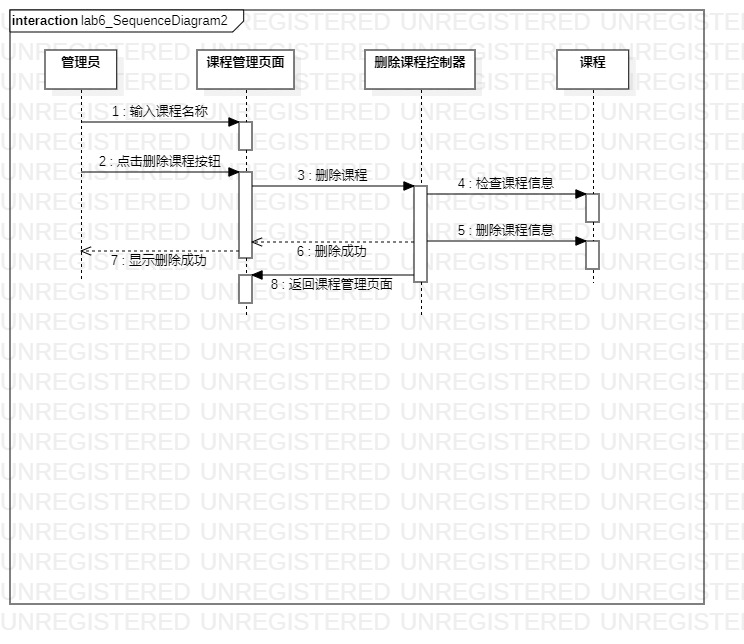

# 实验六：交互建模  

## 一.实验目标  
1.理解系统交互  
2.掌握UML顺序图的画法  
3.掌握对象交互的定义与建模方法  

## 二.实验内容  
1.学习交互建模和顺序图概念  
2.学习顺序图画法  
3.根据用例模型和类模型，确定功能所涉及的系统对象  
4.在用例1顺序图   
5.在用例2顺序图

## 三.实验步骤  
1.观看实验六相关视频  
2.根据视频提示对实验四实验五的类模型进行修改  
3.打开StarUML model新建Sequence Diagram创建开设课程的顺序图  
  - 根据开设课程的用例规约、用例图和类图，找出1+N个参与者，按对象添加Lifeline  
  - 根据开设课程的活动图提炼操作流程，添加Message
  - 建立Reply Message  
  - 审查用例规约确认交互流程匹配  

4.创建删除课程的顺序图  
  - 根据删除课程的用例规约、用例图和类图，找出1+N个参与者，按对象添加Lifeline  
  - 根据删除课程的活动图提炼操作流程，添加Message  
  - 建立Reply Message  
  - 审查用例规约确认交互流程匹配  

## 四.实验结果  
  
图1：开设课程顺序图  

  
图2：删除课程顺序图   

## 五.课堂笔记  
1.顺序图：  
- 参与者  
- 时间（描述了交互发生的顺序）  
- 时间顺序-从上到下，仅表示先后顺序，不表示时间跨度  
- 事件=信号=消息  
- 存活条（显示了发送端和接收端）  
- 消息箭头（同步，异步，返回）  

2.从用例图找到第1个参与者，从类图找到N个参与者，总共1+N个参与者  
3.从活动图找到操作步骤，画出参与者之间的关系  
