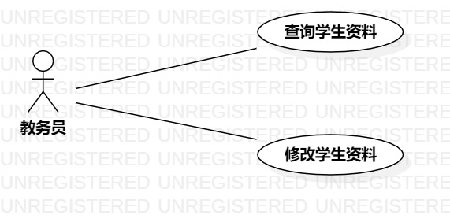

# 实验二：用例建模

## 1. 实验目标
- 选题并完成用例建模
- 完成实验二报告
## 2. 实验内容
- 在StarUML中画建模用例图
- 提交实验报告
## 3. 实验步骤
- 画好Actor（教务员）与 use case(查询资料、修改资料)
- 根据Actor与use case的关系，用Assoication分别进行连接
- 把用例图导出到本地的students/17140809026633目录下
- 将用例图上传到个人库中
- 编写实验报告
## 4. 实验结果

图1：学生资料管理系统的用例图  

## 表1：查询学生资料用例规约  

用例编号  | UC01 | 备注  
-|:-|-  
用例名称  | 查询学生资料  |   
前置条件  | 教务员进入学生资料查询页面     | *可选*   
后置条件  | 教务员进入学生资料显示页面     | *可选*   
基本流程  | 1. 教务员输入学生学号，点击确认按钮  |*用例执行成功的步骤*    
~| 2. 系统检查学号不为空、格式正确，查询学号信息  |   
~| 3. 系统显示学生资料   |    
扩展流程  | 2.1 系统检查学号为空，提示"请输入学号"   |*用例执行失败* 
~| 2.2 系统检查学号格式错误，提示"学号格式错误"   |*用例执行失败*    

## 表2：修改学生资料用例规约  

用例编号  | UC02 | 备注  
-|:-|-  
用例名称  | 修改学生资料  |   
前置条件  | 教务员进入学生资料修改页面     | *可选*   
后置条件  | 系统显示修改成功     | *可选*   
基本流程  | 1. 教务员输入学生信息，点击确认按钮  |*用例执行成功的步骤* 
~| 2. 系统检查学生信息不为空  |
~| 3. 系统保存学生信息  |
~| 4. 系统显示修改成功  |   
扩展流程  | 2.1 系统检查发现学生信息为空,提示"学生信息不能为空"   |*重新输入学生信息*   
