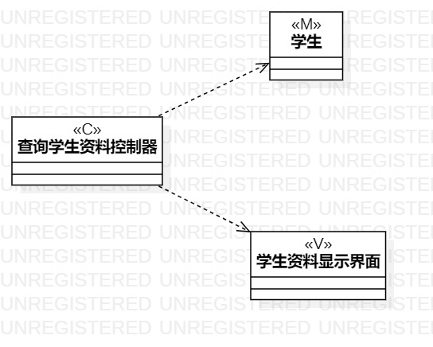
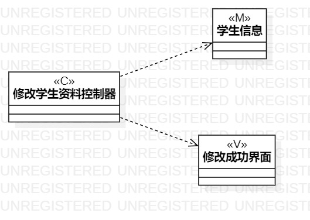

 # 实验四、五：类建模、高级类建模

 ## 一.实验目标
- 掌握类建模方法；
- 了解MVC或你熟悉的设计模式；
- 掌握类图的画法；
- 理解类的5种关系；
- 掌握类之间的画法。

 ## 二.实验步骤
- 分析用例规约一，找出相关的数据
- 学生作为模型类
- 资料显示界面，作为视图类
- 用例名称查询学生资料，作为控制类
- 分析用例规约二，找出相关的数据
- 学生作为模型类
- 修改资料界面，作为视图类
- 用例名称修改学生资料，作为控制类

 ## 三.实验结果

 图1：查询学生资料类图

 

 图2：修改学生资料类图
