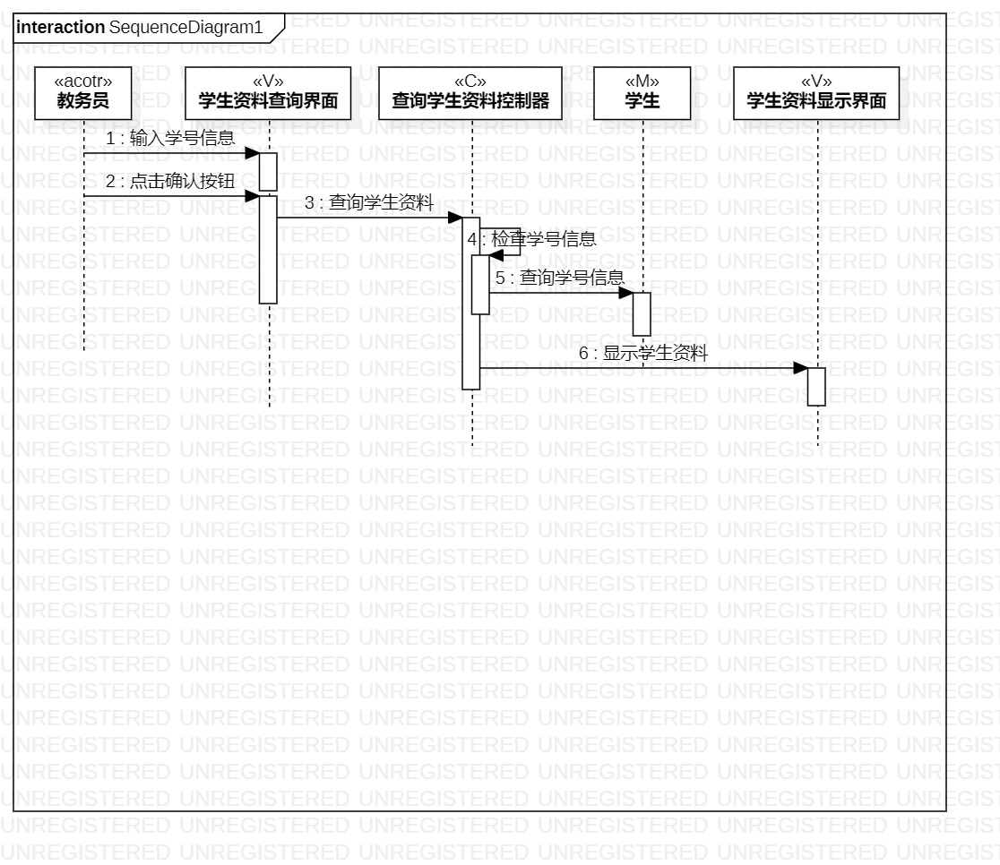
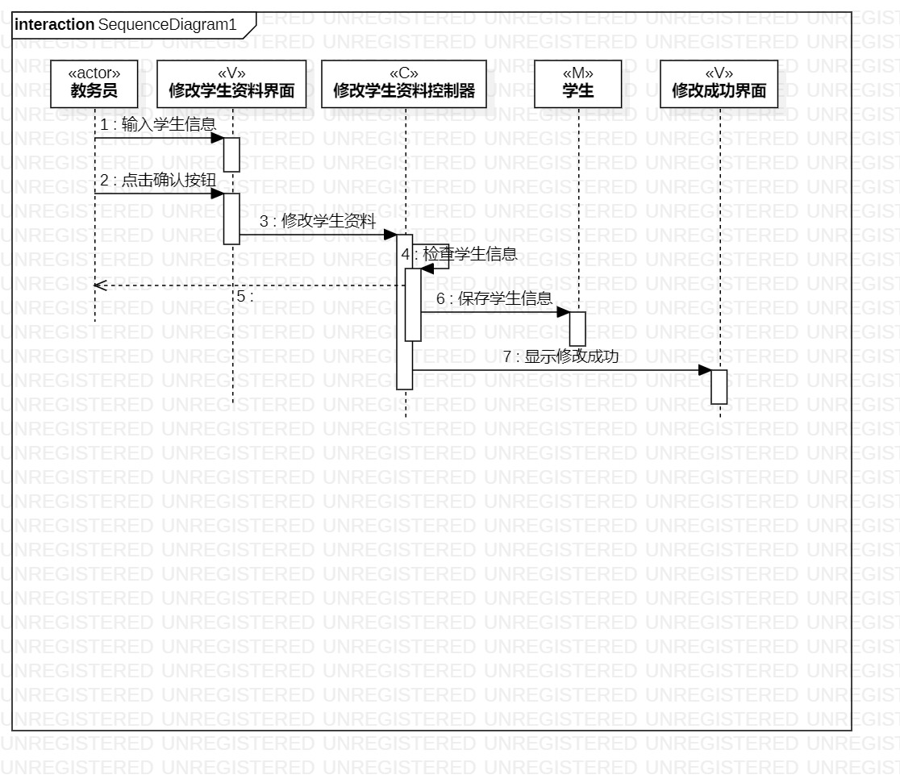

# 实验六：交互建模

## 1. 实验目标

1. 理解系统交互
2. 了解交互建模和顺序图概念
3. 掌握UML顺序图的画法
4. 掌握交互建模方法

## 2. 实验内容

1. 学习交互建模和顺序图概念
- 对象
- 顺序图
2. 学习顺序图画法

## 3. 实验步骤

1. 根据用例模型和类模型，确定功能所涉及的系统对象
2. 根据查询学生资料类图画出所有的Lifeline
3. 根据查询学生资料活动图，按照顺序建立所有的Message
4. 在必要的位置建立Reply Message
5. 修改学生资料的顺序图画法同理

## 4. 实验结果

图1：查询学生资料的顺序图

图2：修改学生资料的顺序图
