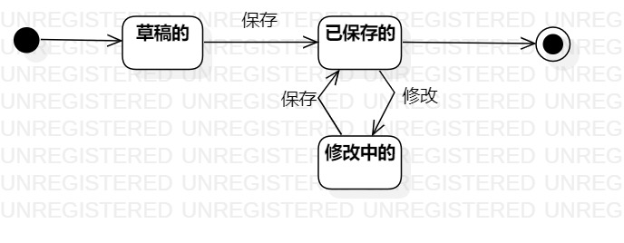

# 实验七：状态建模 

### 一、实验目标
 掌握对象状态建模

### 二、实验内容
  1. 观看教学视频
  2. 根据用例图、活动图、类图、时序图来绘画状态图  
  3. 编写实验报告文档

 ### 三、实验步骤
   1. 分析系统中存在的重要对象
   2. 绘画状态图
   - 寻找一个重要的对象:"学生资料" 
   - 寻找这个对象所有的重要状态。包括草稿的，修改中的，已录入的。 
   - 分析并画出状态之间的转变条件，其中草稿录入后会变成已录入的状态，已录入的状态点击修改后会变成修改中的状态等
   3. 编写实验报告  

 ### 四、实验结果
 

 图1.学生资料状态图
