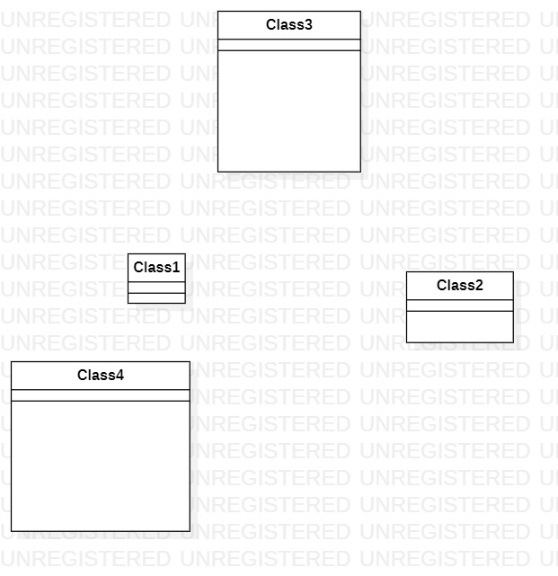

# 实验一

 ## 一、实验目标

 1. 熟悉GitHub实验过程
 
 2. 安装与使用StarUML

 ## 二、实验内容

 1、安装并使用Git

 2、在老师给的GitHub库中fork到自己的GitHub库中并同步到本地

 3、在StarUML上创建图
 

 ## 三、实验步骤

 1、安装Git

 2、在GitHub上创建自己的账户，并把老师的主库fork到私人账户中

 3、将项目clone到自己本地文件夹

 4、在StarUML上创建图，并保存到clone的文件夹目录下

 5、在git中用git add等指令将clone的文件夹更新到GitHub上

 ## 四、实验结果

上图为StarUML创建的一个图.
