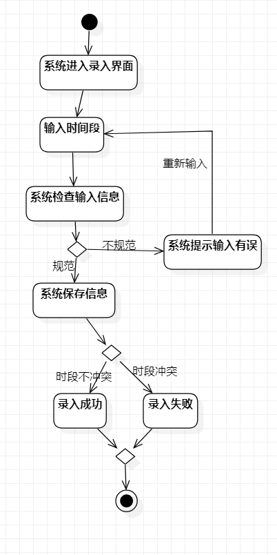
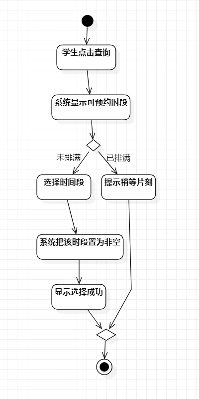

# 实验三

 ## 一、实验目标

 1. 掌握过程建模方法   
 
 2. 掌握活动图的画法   

 ## 二、实验内容

 根据用例建模规约在StarUML上建立活动图
 

 ## 三、实验步骤

 1、打开staruml,熟悉活动图的各个功能部件

 2、根据用例建模规约表，创建初始点和终点，和活动过程，搭建好相关连线，建立活动图
 
 3、保存活动图

 ## 四、实验结果
 

 
 
