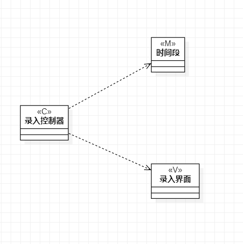
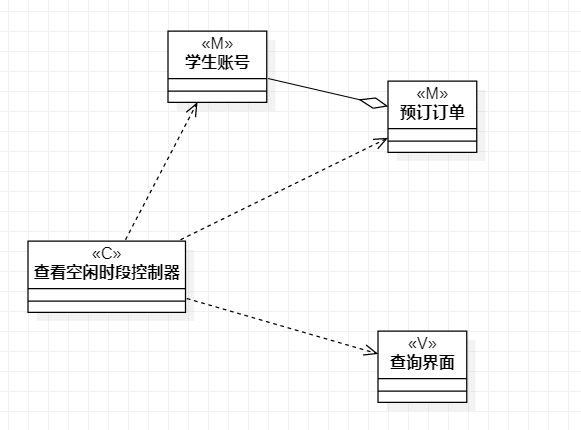

 # 实验四、五

 ## 一、实验目标

 1.掌握类建模方法
 
 2.了解MVC的设计模式
 
 3.掌握类图的画法（Class Diagram） 

 ## 二、实验内容

 1. 查看南苑6健身房预定系统的用例规约
  
 2. 画出其用例的类图
 
 ## 三、实验步骤
 
 1. 查看健身房预定系统用例规约
 
 2. 画出录入空闲时段类图
 
 3. 画出查看空闲时段类图

  ## 4.实验结果
-  图一：录入空闲时段类图
  
-  图二：查看空闲时段类图
  
