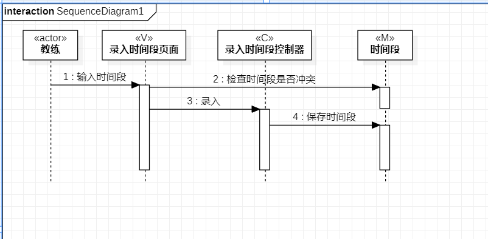
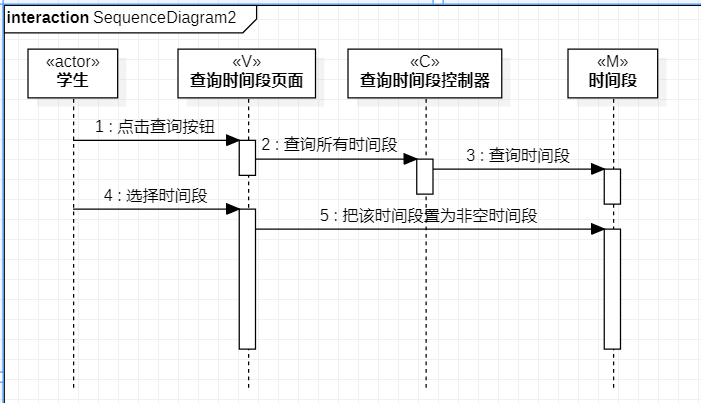

# 实验六：交互建模

  ## 实验目标

 1.  理解系统交互；
 2.  掌握UML顺序图的画法；
 3.  掌握对象交互的定义与建模方法。

  ## 实验内容

 1.  根据用例模型和类模型，确定功能所涉及的系统对象；
 2.  在顺序图上画出参与者（对象）；
 3.  在顺序图上画出消息（交互）。

  ## 实验步骤

 1. 在staruml中新建顺序图，每个用例对应一个顺序图；
 2. 从用例图找到第一个参与者（Actor）；
 3. 从类图找到N个参与者，总共1+N个参与者；
 4. 从活动图找到操作步骤，画出参与者之间的消息。

  ## 实验结果

    
 图1：录入时间段的顺序图

    
 图2：查询时间段的顺序图
