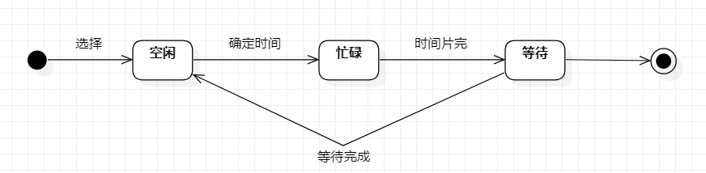

# 实验七：状态建模 
### 一、实验目标
 掌握对象状态建模
### 二、实验内容
  1. 观看教学视频
  2. 根据用例图、活动图、类图、时序图来绘画状态图  
  3. 编写实验报告文档
 ### 三、实验步骤
   1. 分析系统中存在的重要对象，对象的状态以及转变条件。
   2. 绘画状态图
   - 系统中一个重要的对象:"时间段" 。
   - 寻找这个对象所有的重要状态包括：空闲，等待，忙碌。 
   - 写出状态之间的转变条件。

  ### 四、实验结果
     

   图1.时间段状态图
 
