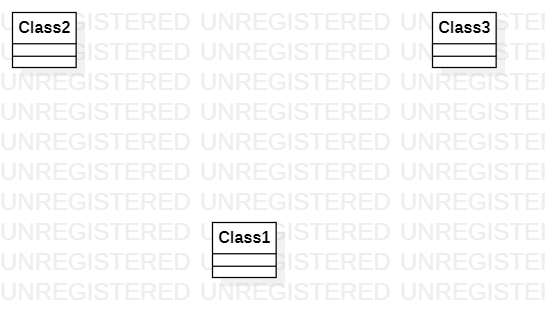

# 实验一:下载并安装UML工具

## 一、实验目标
- 1.熟悉github提交实验的操作
- 2.使用StarUML软件绘制图
## 二、实验内容
- 1.安装Git Bash与熟悉基本的提交实验的指令
- 2.安装StarUML并使用其创建图
## 三、实验步骤
- 1.打开Git Bash，用git clone克隆代码到本地磁盘
- 2.打开StarUML创建第一个图
- 3.建立实验文档，并在文档中使用创建的图
- 4.打开Git Bash，用add、commit、push指令将实验送到个人库
- 5.使用pull requests将个人库中的实验传送到主库 
## 四、实验结果

图1 在StarUML创建第一个图

