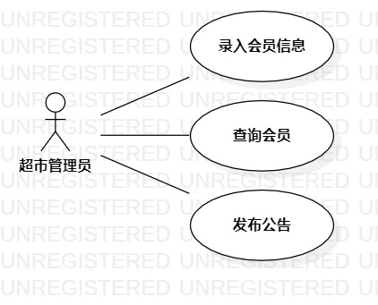

# 实验二：用例建模

## 一、实验目标

- 完成选题并掌握用例建模
- 绘制用例图
- 编写用例规约
## 二、实验内容

- 选题后功能分析
- 创建功能用例图
- 编写用例规约

## 三、实验步骤

- 确定选题： 超市会员管理系统
- 确定选题功能：
  （1）录入会员信息
  （2）修改会员信息
  （3）转移积分
- 确定参与者：管理员
- 使用StarUML创建用例图
- 编写功能的用例规约

## 四、实验结果

  
图1：超市会员管理系统用例图

## 表1：录入会员信息用例规约  

用例编号  | UC01 | 备注  
-|:-|-  
用例名称  |录入会员信息  |   
前置条件  |超市管理员登录超市会员管理系统     | *可选*   
后置条件  |     | *可选*   
基本流程  | 1.超市管理员点击录入会员信息按钮；  |*用例执行成功的步骤*    
~| 2.系统显示录入会员页面；  |   
~| 3.超市管理员输入会员信息，点击录入按钮；  |   
~| 4.系统根据ID查询会员信息，ID不重复，保存会员信息；   |   
~| 5.系统提示”录入成功”。   |   
扩展流程  | 4.1 系统查询到ID已存在，系统提示”录入失败”。  |*用例执行失败*   

## 表2：修改会员信息用例规约  

用例编号  | UC02 | 备注  
-|:-|-  
用例名称  | 修改会员信息  |   
前置条件  | 超市管理员登录超市会员管理系统      | *可选*   
后置条件  |   | *可选*   
基本流程  | 1.超市管理员进入会员个人信息页面；  |*用例执行成功的步骤*    
~| 2.超市管理员点击修改信息按钮；  |   
~| 3.系统显示会员信息修改页面；  |   
~| 4.超市管理员修改会员信息，点击保存按钮；  |   
~| 5.系统查询会员信息，发现信息不为空且未存在完全相同的信息，保存新的会员信息；  |  
~| 6.系统提示”修改成功”。  | 
扩展流程  | 5.1 系统检测到有信息为空，提示“信息未填写完整”  |*用例执行失败*    
~| 5.2 信息与修改前一致，提示”未做任何修改！”  |  

## 表3：转移积分规约  

用例编号  | UC03 | 备注  
-|:-|-  
用例名称  | 转移积分  |   
前置条件  | 超市管理员进入会员个人信息页面     | *可选*   
后置条件  |      | *可选*   
基本流程  | 1.超市管理员点击转移积分按钮;  |*用例执行成功的步骤*    
~| 2.系统检查到当前账号积分不为0；   | 
~| 3.超市管理员输入转入的账户ID，点击转移按钮;   |   
~| 4.系统检查待转入的ID存在;   |   
~| 5.系统更新新旧账号积分 ;  |   
~| 6.系统提示“积分转移成功” 。  |  
扩展流程  | 2.1系统检查到当前账户积分为0，系统提示“当前积分为0” ；|*用例执行失败*    
~| 4.1 系统检测到转入的账号不存在，提示“账号不存在”。   |  
