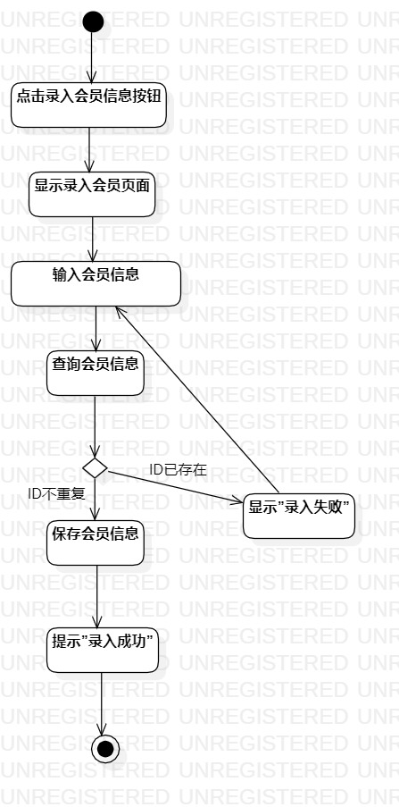
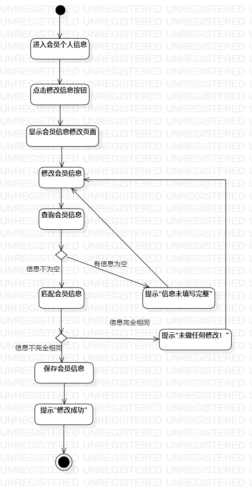
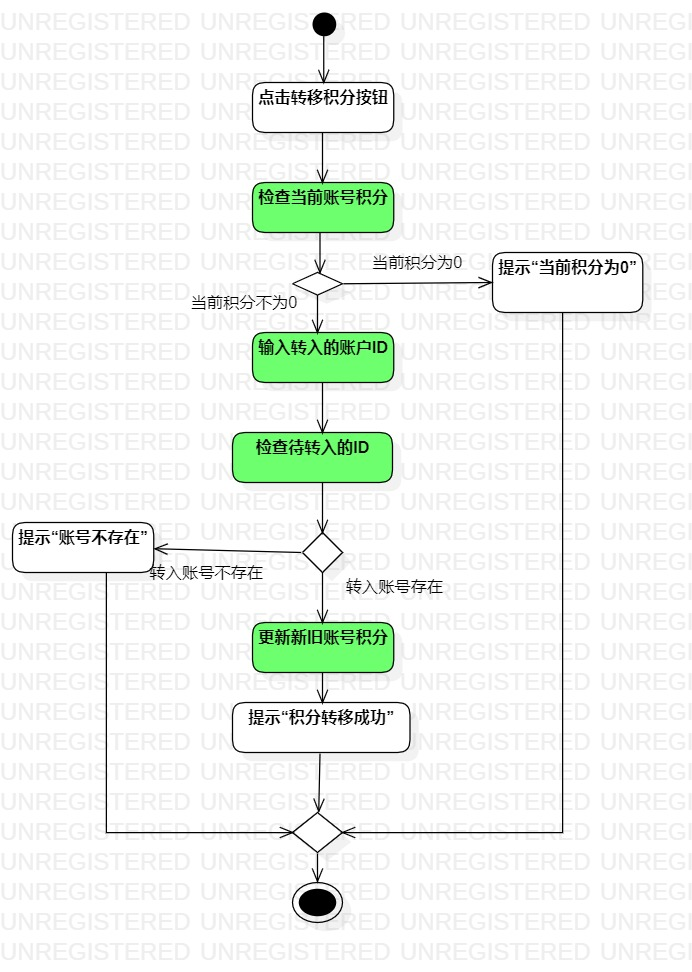

# 实验三:过程建模

## 一、实验目标
- 掌握过程建模。
- 绘制活动图（Activity Diagram）。
## 二、实验内容
- 绘制与用例规约相对应的活动图。
## 三、实验步骤
- 根据用例规约绘制录入会员信息、修改会员信息和转移积分活动图
  1.添加开始(Initial)节点
  2.添加结束(Final)节点
	3.把基本流程和扩展流程的动作画为操作（Action）节点
	4.分支的操作之后使用决策（Decision）节点

## 四、实验结果

图1 录入会员信息活动图

图2 修改会员信息活动图

图3 转移积分活动图
