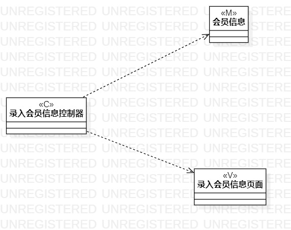
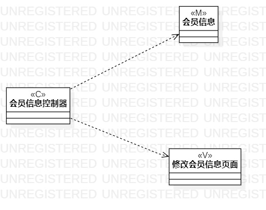
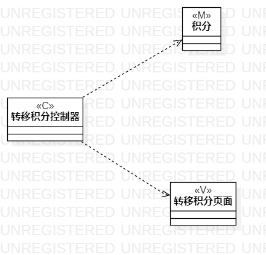

# 实验四:类建模
# 实验五:高级类建模

## 一、实验目标
- 掌握类的概念
- 理解类的5种关系和4种画法
- 掌握类建模方法
- 理解MVC设计模式
- 掌握类之间关系的画法

## 二、实验内容
- 根据用例规约绘制相应的类图。
   1.录入会员信息类
   2.修改会员信息类
   3.转移积分类

## 三、实验步骤
-  从用例规约中的基本流程和扩展流程中找出类
- 根据系统操作设计业务服务类
- 根据mvc设计模式确定类的关系
   1.绘制模型类
   2.绘制视图类
   3.绘制控制器类
   4.确定类之间的关系   
-  在StarUml中创建好相对应的类图
   1.录入会员信息类
   2.修改会员信息类
   3.转移积分类

## 四、实验结果

图1 录入会员信息类图

图2 修改会员信息类图

图3 转移积分类图