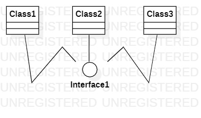

# 实验一

## 一、实验目标

1. 熟悉GITHUB实验过程
2. 安装与使用StarUML

## 二、实验内容

1. 安装GIT，并练习使用GIT BASH
2. 安装StarUML，并创建一个图

## 三、实验步骤

1. 打开StarUML软件随意画一个图
2. 将所画的图以.jpg的格式保存到学号文件夹
3. 用git bash将图片上传到github个人库中
4. 完善lab1.md

## 四、实验结果

1. 画图

  
图1. 在StarUML上创建的第一个图
