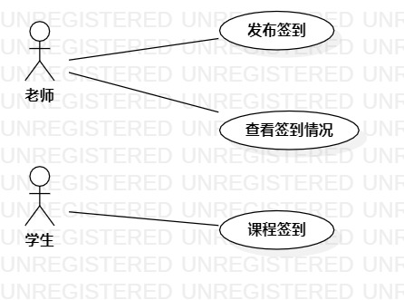

# 实验二：用例建模

## 一、实验目标

1. 选题，并用例建模
3. 用markdown编写实验报告

## 二、实验内容

1. 创建所选题的用例图
2. 编写规约和实验二报告文档

## 三、实验步骤

1. 选题：网课签到系统
2. 确定系统三个主要功能 
- 发布签到
- 课程签到 
- 查看签到情况
3. 新建用例图 
- 添加两个actor：老师和学生
- 添加老师use case：发布签到、查看签到情况
- 添加学生use case：课程签到
- 建立关系association
4. 编写用例规约

## 四、实验结果

  
图1. 网课签到系统的用例图

## 表1：发布签到用例规约  

用例编号  | UC01 | 备注  
-|:-|-  
用例名称  |  发布签到 |   
前置条件  |  用户身份为老师，已经登录，进入签到信息填写页面   | *可选*   
后置条件  |  老师成功发布签到   | *可选*   
基本流程  | 1. 老师输入签到的课程名称和时间，点击确认按钮；  |*用例执行成功的步骤* 
~| 2. 系统检查签到的课程名称和时间均不为空； |
~| 3. 系统检查当前该课程的老师发布状态为未发布； |
~| 4. 系统将当前该课程的老师发布状态设置为已发布，并保存该签到信息； |
~| 5. 系统提示“课程签到信息发布成功”； |
扩展流程  | 2.1 系统检查签到的课程名称为空或签到的时间为空、或者两者均为空，提示"课程名称和时间均不为空，请按要求填写信息"； |*用例执行失败*
~| 3.1 系统检查此时该课程的老师发布状态为已发布，提示“已发布该课程”； |

## 表2：课程签到用例规约  

用例编号  | UC02 | 备注  
-|:-|-  
用例名称  |  课程签到 |   
前置条件  |  用户身份为学生，已经登录且已选定签到课程，老师已发布签到信息，且默认学生初始的签到状态为缺勤   | *可选*   
后置条件  |  学生成功签到   | *可选*   
基本流程  | 1. 学生点击签到按钮； |*用例执行成功的步骤*
~| 2. 系统检查当前该课程的学生签到状态为未签到； |
~| 3. 系统检查学生签到时间在课程签到时间内； |
~| 4. 系统将当前该课程的学生签到状态设置为已签到，并保存该签到记录； |
~| 5. 系统提示“课程签到成功”； |
扩展流程  | 2.1 系统检查当前该课程的学生签到状态为已签到，提示“已签到该课程”； |*用例执行失败*
~| 3.1 系统检查学生签到时间不在课程签到时间内，提示"签到失败"，并记录该学生迟到； |

## 表3：查看签到情况用例规约  

用例编号  | UC03 | 备注  
-|:-|-  
用例名称  |  查看签到情况 |   
前置条件  |  用户身份为老师，已经登录且已选定查看签到课程，在签到时间段内或者签到结束之后   | *可选*   
后置条件  |  系统显示学生签到情况   | *可选*   
基本流程  | 1. 老师点击查看按钮； |*用例执行成功的步骤* 
~| 2. 系统检索当前每名学生签到的记录； | 
~| 3. 系统保存该老师此次的查看记录； | 
~| 4. 系统显示该课程目前的学生签到情况； |
扩展流程  | |*用例执行失败* 

