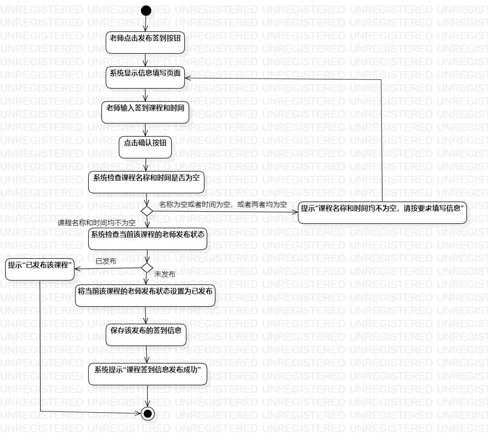
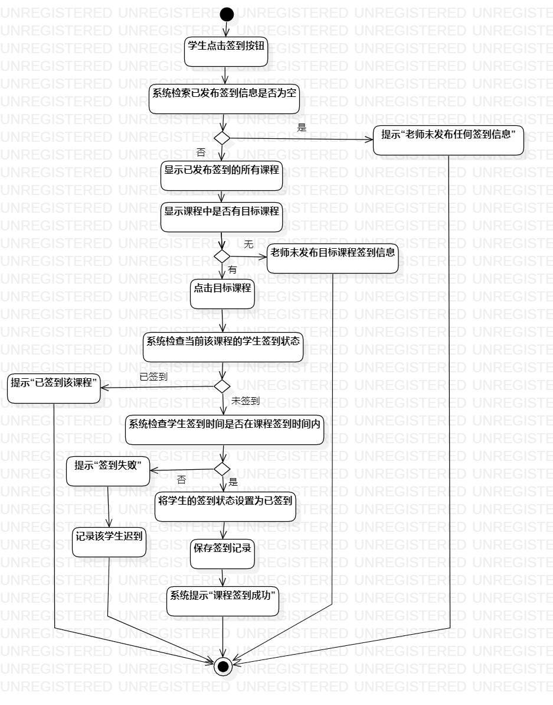
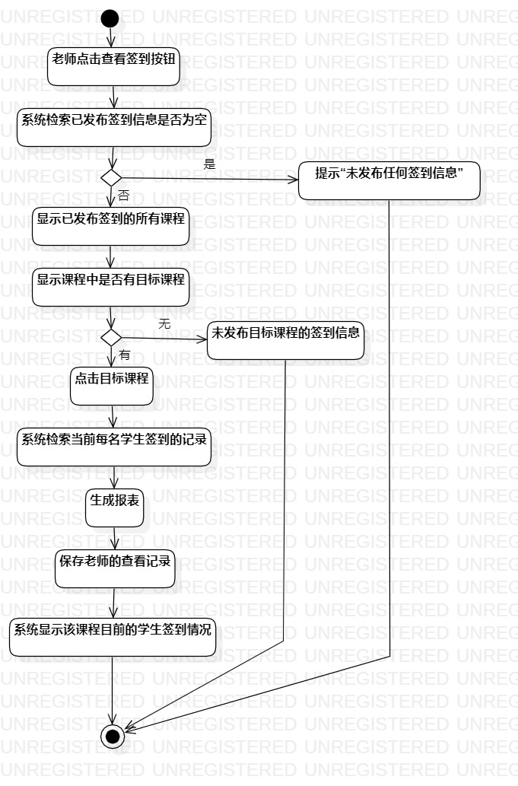

# 实验三：过程建模

## 一、实验目标

1. 掌握过程建模方法。
2. 掌握活动图的画法。

## 二、实验内容

1. 根据用例规约画出活动图。
2. 编写实验报告

## 三、实验步骤

1. 添加Initial和Final
2. 根据用例规约的基本流程和扩展流程添加Action
3. 用Control flow连接各个部分
4. 分析活动图的合理性，进一步完善活动图和用例规约
5. 其他用例规约遵循上述步骤

## 四、实验结果

  
图1：发布签到的活动图

  
图2：课程签到的活动图

  
图3：查看签到情况的活动图
