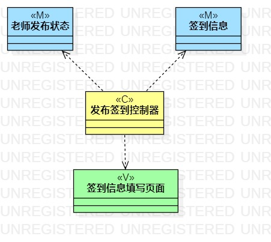
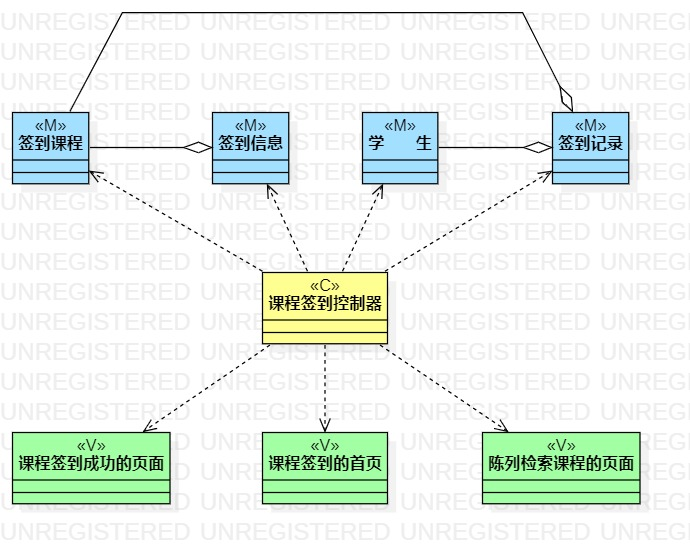
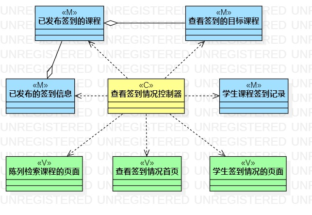

# 实验四:类建模
# 实验五:高级类建模

## 一、实验目标
1. 掌握类的概念
2. 掌握类建模方法
3. 了解MVC设计模式
4. 理解类的5种关系

## 二、实验内容
1. 根据用例规约绘制相应的类图
- 发布签到类图
- 课程签到类图
- 查询签到情况类图

## 三、实验步骤
1. 根据用例规约的基本流程和扩展流程中寻找类
2. 将找出的类在StarUML中将其画出
3. 根据MVC设计模式确定类的关系
4. 用正确的关系箭头连线
5. 综合分析，进一步完善类图，并完成lab4.md

## 四、实验结果
  
图1：发布签到类图

  
图2：课程签到类图

  
图3：查询签到情况类图
