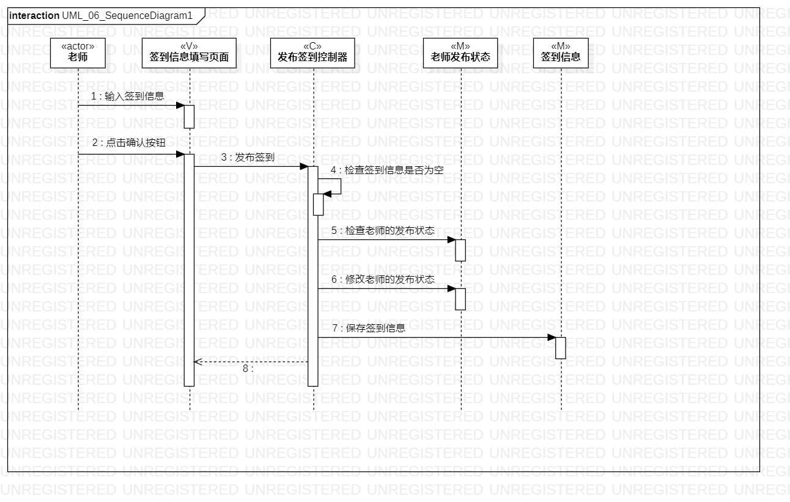
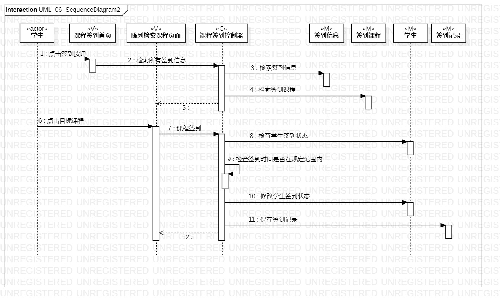
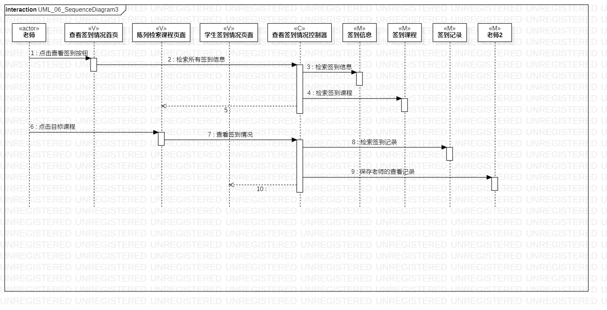

# 实验六：交互建模

## 一、实验目标
1. 理解系统交互的概念。 
2. 掌握UML顺序图的画法。 
3. 掌握对象交互的定义与建模方法。 

## 二、实验内容
1. 根据活动图和类图，确定功能所涉及的系统对象。  
2. 在顺序图上画出参与者。  
3. 在顺序图上画出消息。 

## 三、实验步骤
1. 根据实验二用例建模确定用户，添加actor
2. 根据实验四、实验五类建模确定对象，添加Lifeline  
3. 根据实验二用例建模、实验三过程建模确定消息，添加message  
4. 根据实验二用例建模、实验三过程建模确定返回消息，添加Reply Message  
5. 对建好的顺序图进行分析，进一步完善实验

## 四、实验结果
  
图1：发布签到顺序图

  
图2：课程签到顺序图

  
图3：查看签到情况顺序图
