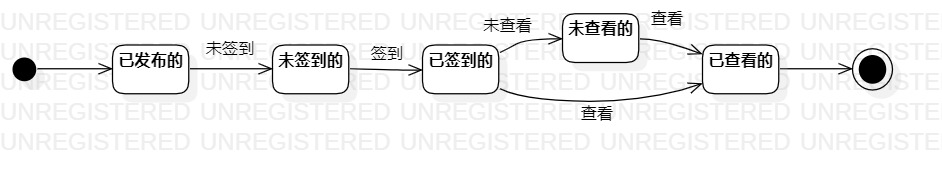

# 实验七：状态建模

## 一、实验目标
1. 掌握对象的状态建模（Statechart）。

## 二、实验内容
1. 根据用例图、活动图、类图、顺序图来画出状态图;
2. 编写实验报告文档。

## 三、实验步骤
1. 根据用例图、活动图、类图、顺序图找出关键对象：签到（这里为名词）；
2. 通过分析得出签到的状态有：已发布的、未签到的、已签到的、未查看的、已查看的；
3. 在StarUML画出签到的状态图:
- 创建并命名为UML_07_StatechartDiagram1；
- 添加Initial State和Final State；
- 添加状态，并画出状态之间的转变条件。
4. 编写实验报告文档。

## 四、实验结果
  
图1：签到的状态图

## 五、课堂笔记
1. 在选取对象时，要考虑对象既要存在于现实、也要存在于计算机内存中的;
2. 对象的状态取决于对象所包含的所有数据;
3. 对象所包含的数据发生变化时，对象的状态也一定发生变化;
4. 未存在于系统中的，不可作为状态;
5. 状态图画法:
- 找出一个关键的对象;
- 设计该对象的所有关键状态（使用形容词来表示状态）;
- 画出状态之间的转变条件。
