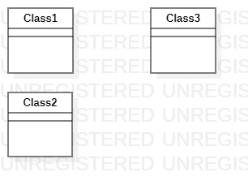
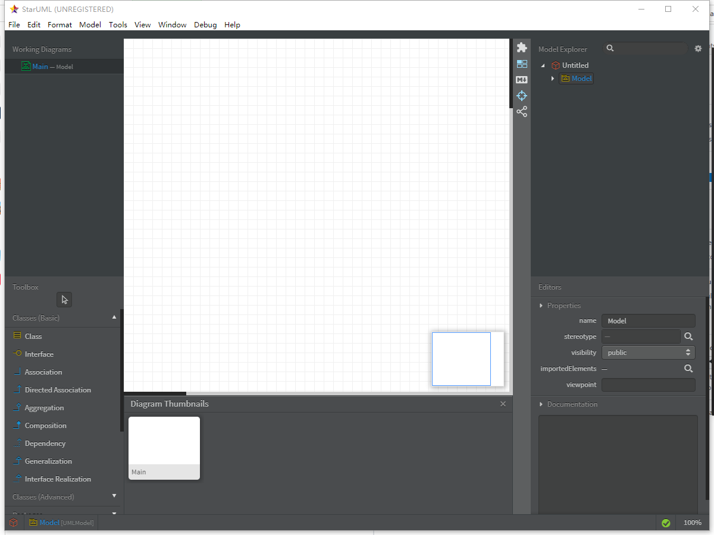

 # 实验一：UML建模工具 

 ## 一、实验目标

 1. 安装并使用StarUML和Git
 2. 确认选题及其功能要求
 3. 学习画第一个UML模型图
 4. 使用git上传作业

 ## 二、实验内容

 - 下载并安装建模工具 StarUML
 - 确定个人建模选题 
 - 画UML图
 

 ## 三、实验步骤

 - 新建new model并打开Main图
 - 在左下角的工具箱中点击Class按钮
 - 点击Main图
 - 重复以上两个步骤两次
 - 点击File -> Export diagrams as -> .jpg

 ## 四、实验结果
 -     
 图1：第一张UML图
 -     图2：StarUML安装完成截图

# 选题

- 系统名称：竞赛项目管理系统 
- 系统功能：
1.录入项目信息
2.修改项目信息
3.删除项目信息
