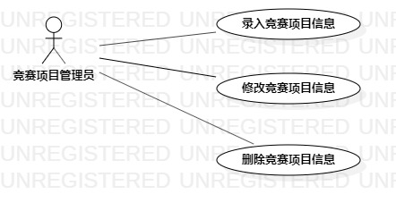

# 实验二：用例建模

 ## 一、实验目标

 1. 理解UML和UML的概念
 2. 使用StarUML绘制出系统的用例图
 

 ## 二、实验内容

 - 细化功能需求。
 - 画出用例图（Use Case Diagram）。
 - 编写用例规约（表格）。
 

 ## 三、实验步骤

 - 确定自己的issue题目和功能
 - 根据题目来确定需要的用例和参与者
 - 使用StarUML画出系统的用例图
 - 导出用例图lab2_UseCaseDiagram.jpg
 - 完成实验报告lab2.md
 - 通过git将修改提交网上
 - 通过 pull requests 提交给老师

 ## 四、实验结果
 -   图1：竞赛项目管理系统用例图
 

实验要求
给每一个功能点写一段描述（字数至少60字，3行）。
写清楚使用功能的用户。
说明该功能执行之后产生的结果。
用例规约必填：基本流程（成功执行用例的步骤）；扩展流程（引起用例失败的步骤）。
