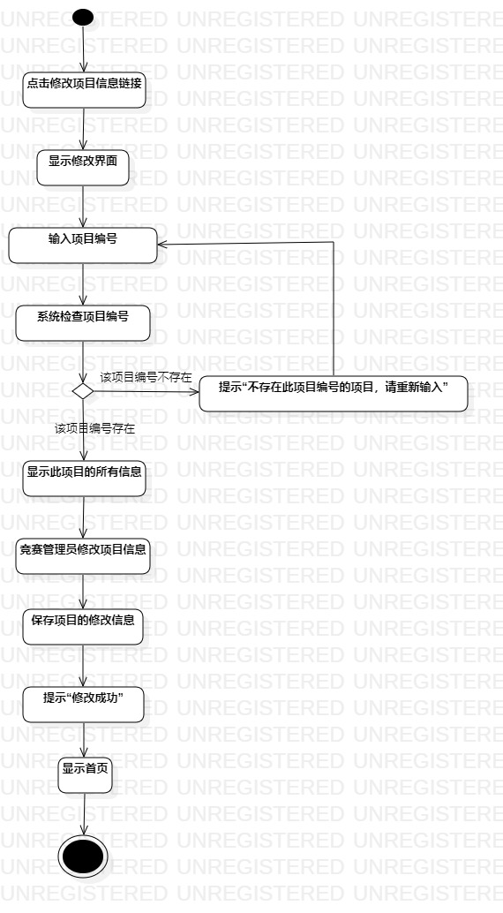
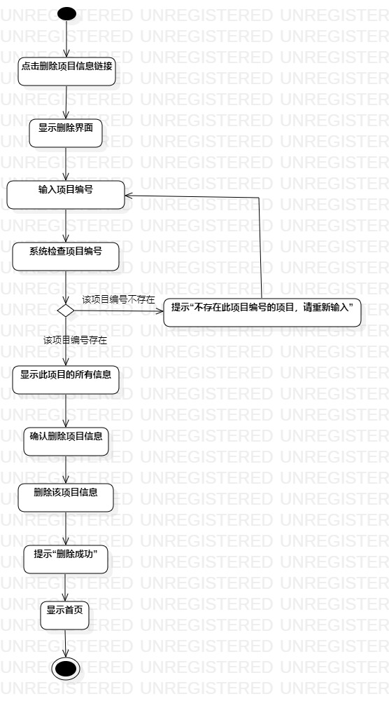

# 实验三：过程建模  

## 一、实验目标

#### 1. 学习过程建模的相关知识；  
#### 2. 绘制出自己系统的活动图。  

## 二、实验内容  

#### 1. 阅读gitbub资料，观看B站视频；  
#### 2. 画系统的活动图并完成实验报告。  
  

## 三、 实验步骤
#### 1.画录入竞赛项目信息活动图
- 在StarUML的model里新建一个Activity Diagram，命名为"录入竞赛项目信息活动图"；
- 使用Initial和Final分别在顶部和底部建立开始和结束部件；
- 根据实验二中的UC01规约中的步骤依次新建“点击录入项目信息链接”、“显示录入界面”、“输入项目信息”、“点击录入按钮”、“系统检查项目编号”、“提示'此项目编号已被占用，请输入其他编号' ”、“保存此项目信息”、“提示'录入成功' ”、“显示首页”的Action部件；
- 在“检查项目编号”Action后新建一个Decision分别连接“提示'此项目编号已被占用，请输入其他编号' ”和“保存此项目信息”Action，并各自给他们之间的连线命名为：“该项目编号已存在”和“该项目编号不存在”；
- 选用连线将“提示'此项目编号已被占用，请输入其他编号' ”Action与“输入项目信息”Action相连；
- 其余未特别说明的部件按顺序连线。

#### 2.画修改竞赛项目信息活动图
- 新建一个Activity Diagram，命名为“修改竞赛项目信息的活动图”、；
- 使用Initial和Final分别在顶部和底部建立开始和结束部件；
- 根据实验二中的UC02规约中的步骤依次新建“点击修改项目信息链接”、“显示修改界面”、“输入项目编号”、“系统检查项目编号”、“提示'不存在此项目编号的项目，请重新输入' ”、“显示项目信息”、“竞赛管理员修改项目信息”、“保存修改信息”、“提示'修改成功' ”、“显示首页”的Action部件；
- 在“检查项目编号”Action后新建一个Decision分别连接“提示'不存在此项目编号的项目，请重新输入' ”和“显示项目信息”Action，并各自给他们之间的连线命名为：“该项目编号不存在”和“该项目编号存在”；
- 选用连线将“提示'不存在此项目编号的项目，请重新输入' ”Action与“输入项目编号”Action相连；
- 其余未特别说明的部件按顺序连线。

#### 3.画删除竞赛项目信息活动图
- 新建一个Activity Diagram，命名为“删除竞赛项目信息的活动图”
- 使用Initial和Final分别在顶部和底部建立开始和结束部件；
- 根据实验二中的UC03规约中的步骤依次新建“点击删除项目信息链接”、“显示删除界面”、“输入项目编号”、“系统检查项目编号”、“提示'不存在此项目编号的项目，请重新输入' ”、“显示项目信息”、“点击确认删除按钮”、“删除项目信息”、“提示'删除成功' ”、“显示首页”的Action部件；
- 在“检查项目编号”Action后新建一个Decision分别连接“提示'不存在此项目编号的项目，请重新输入' ”和“显示项目信息”Action，并各自给他们之间的连线命名为：“该项目编号不存在”和“该项目编号存在”；
- 选用连线将“提示'不存在此项目编号的项目，请重新输入' ”Action与“输入项目编号”Action相连；
- 其余未特别说明的部件按顺序连线。

#### 4.整理导出
- 整理活动图，对齐；
- 导出活动图为“.jpg”格式，命名为lab3_1.jpg、lab3_2.jpg、lab3_3.jpg。

## 四、 实验结果  

-   
图1：录入竞赛项目信息的活动图

-   
图2：修改竞赛项目信息的活动图

-   
图3：删除竞赛项目信息的活动图
