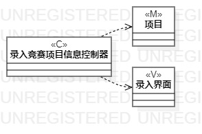
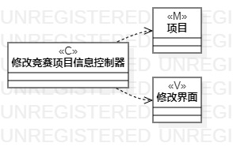
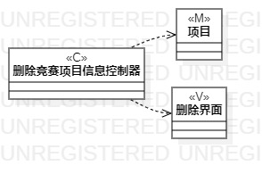

# 实验四：类建模  

## 一、实验目标
 
#### 1.掌握类建模方法；
#### 2.了解MVC或你熟悉的设计模式；
#### 3.掌握类图的画法。（Class Diagram）

## 二、实验内容  

#### 1. 基于MVC模式设计类；
#### 2.设计类的关系；
#### 3.画出类图。 
  

## 三、 实验步骤

#### 1.录入竞赛项目信息的类图
- 新建一个类图,命名为“录入竞赛项目信息的类图”；
- 在类图中选用CLass部件：新建一个名为“项目”的model类、新建一个名为“录入竞赛项目信息控制器”的control类、新建一个名为“录入界面”的view类；
- 使用dependency部件将“录入竞赛项目信息控制器”control类与“项目”model类、“录入界面”view类分别相连；

#### 2.修改竞赛项目信息的类图
- 新建一个类图,命名为“修改竞赛项目信息的类图”；
- 在类图中选用CLass部件：新建一个名为“项目”的model类、新建一个名为“修改竞赛项目信息控制器”的control类、新建一个名为“修改界面”的view类；
- 使用dependency部件将“修改竞赛项目信息控制器”control类与“项目”model类、“修改界面”view类分别相连；

#### 3.删除竞赛项目信息的类图
- 新建一个类图,命名为“删除竞赛项目信息的类图”；
- 在类图中选用CLass部件：新建一个名为“项目”的model类、新建一个名为“删除竞赛项目信息控制器”的control类、新建一个名为“删除界面”的view类；
- 使用dependency部件将“删除竞赛项目信息控制器”control类与“项目”model类、“删除界面”view类分别相连；

#### 4.整理并导出
- 利用StarUML自带的排列工具：Formal - Layout - Auto 从右到左排列三个类图；
- 将三个类图导出为“.jpg”格式，分别命名为lab45_1.jpg、lab45_2.jpg、lab45_3.jpg。

## 四、 实验结果  

-   
图1：录入竞赛项目信息的类图

-   
图2：修改竞赛项目信息的类图

-   
图3：删除竞赛项目信息的类图
