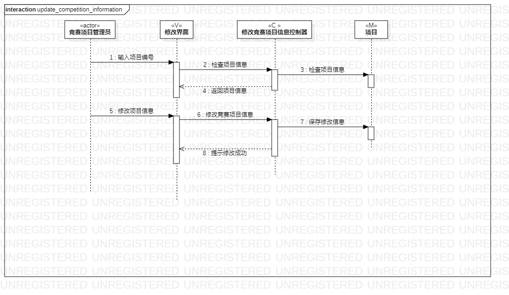
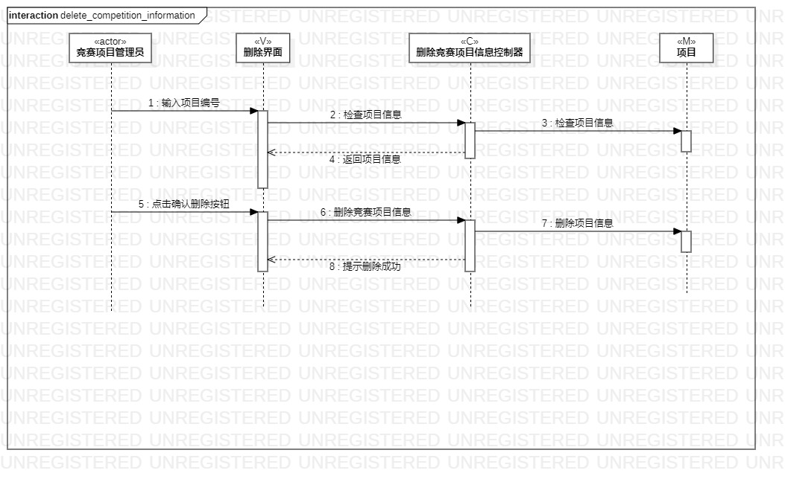

# 实验六：对象建模  

## 一、实验目标
 
#### 1.理解系统交互； 
#### 2.掌握UML顺序图的画法； 
#### 3.掌握对象交互的定义与建模方法。 

## 二、实验内容  

#### 1.根据用例模型和类模型，确定功能所涉及的系统对象；
#### 2.在顺序图上画出参与者（对象）；
#### 3.在顺序图上画出消息（交互）。 
  

## 三、 实验步骤

#### 1.录入竞赛项目信息的顺序图
- 新建一个顺序图,命名为“add_competition_information”；
- 在顺序图中选用Lifeline部件：新建一个名为“竞赛项目管理员”的actor类型的生命线、新建一个名为“录入竞赛项目信息控制器”的control类型的生命线、新建一个名为“录入界面”的view类型的生命线、新建一个名为“项目”的model类型的生命线；
- 使用Message工具：新建从“竞赛项目管理员”生命线开始到“录入界面”生命线结束的“输入项目信息”的消息；再从“录入界面”生命线有效时间开始到“录入竞赛项目信息控制器”生命线结束的“检查项目信息”的消息；再从“录入竞赛项目信息控制器”生命线有效时间开始到“项目”生命线结束的“检查项目编号”的消息；
- 重新使用Message工具：新建从“竞赛项目管理员”生命线开始到“录入界面”生命线结束的“点击录入按钮”的消息；再从“录入界面”生命线有效时间开始到“录入竞赛项目信息控制器”生命线结束的“录入竞赛项目信息”的消息；再从“录入竞赛项目信息控制器”生命线有效时间开始到“项目”生命线结束的“保存项目信息”的消息；
- 使用Reply Message工具：新建从“录入竞赛项目信息控制器”生命线有效时间开始到“录入界面”生命线有效时间结束的“提示录入成功”的回复消息；

#### 2.修改竞赛项目信息的顺序图
- 新建一个顺序图,命名为“update_competition_information”；
- 在顺序图中选用Lifeline部件：新建一个名为“竞赛项目管理员”的actor类型的生命线、新建一个名为“修改竞赛项目信息控制器”的control类型的生命线、新建一个名为“修改界面”的view类型的生命线、新建一个名为“项目”的model类型的生命线；
- 使用Message工具：新建从“竞赛项目管理员”生命线开始到“修改界面”生命线结束的“输入项目编号”的消息；再从“修改界面”生命线有效时间开始到“修改竞赛项目信息控制器”生命线结束的“检查项目信息”的消息；再从“修改竞赛项目信息控制器”生命线有效时间开始到“项目”生命线结束的“检查项目信息”的消息；
- 使用Reply Message工具：新建从“修改竞赛项目信息控制器”生命线有效时间开始到“修改界面”生命线有效时间结束的“返回项目信息”的回复消息；
- 重新使用Message工具：新建从“竞赛项目管理员”生命线开始到“修改界面”生命线结束的“修改项目信息”的消息；再从“修改界面”生命线有效时间开始到“修改竞赛项目信息控制器”生命线结束的“修改竞赛项目信息”的消息；再从“修改竞赛项目信息控制器”生命线有效时间开始到“项目”生命线结束的“保存修改信息”的消息；
- 使用Reply Message工具：新建从“修改竞赛项目信息控制器”生命线有效时间开始到“修改界面”生命线有效时间结束的“提示修改成功”的回复消息；

#### 3.删除竞赛项目信息的顺序图
- 新建一个顺序图,命名为“delete_competition_information”；
- 在顺序图中选用Lifeline部件：新建一个名为“竞赛项目管理员”的actor类型的生命线、新建一个名为“删除竞赛项目信息控制器”的control类型的生命线、新建一个名为“删除界面”的view类型的生命线、新建一个名为“项目”的model类型的生命线；
- 使用Message工具：新建从“竞赛项目管理员”生命线开始到“删除界面”生命线结束的“输入项目编号”的消息；再从“删除界面”生命线有效时间开始到“删除竞赛项目信息控制器”生命线结束的“检查项目信息”的消息；再从“删除竞赛项目信息控制器”生命线有效时间开始到“项目”生命线结束的“检查项目信息”的消息；
- 使用Reply Message工具：新建从“删除竞赛项目信息控制器”生命线有效时间开始到“删除界面”生命线有效时间结束的“返回项目信息”的回复消息；
- 重新使用Message工具：新建从“竞赛项目管理员”生命线开始到“删除界面”生命线结束的“点击确认删除按钮”的消息；再从“删除界面”生命线有效时间开始到“删除竞赛项目信息控制器”生命线结束的“删除竞赛项目信息”的消息；再从“删除竞赛项目信息控制器”生命线有效时间开始到“项目”生命线结束的“删除项目信息”的消息；
- 使用Reply Message工具：新建从“删除竞赛项目信息控制器”生命线有效时间开始到“删除界面”生命线有效时间结束的“提示删除成功”的回复消息；

#### 4.整理并导出
- 利用StarUML自带的排列工具：Formal - Layout - Auto 从右到左排列三个顺序图；
- 将三个顺序图导出为“.jpg”格式，分别命名为lab6_1.jpg、lab6_2.jpg、lab6_3.jpg。

## 四、 实验结果  

-   
图1：录入竞赛项目信息的顺序图

-   
图2：修改竞赛项目信息的顺序图

-   
图3：删除竞赛项目信息的顺序图