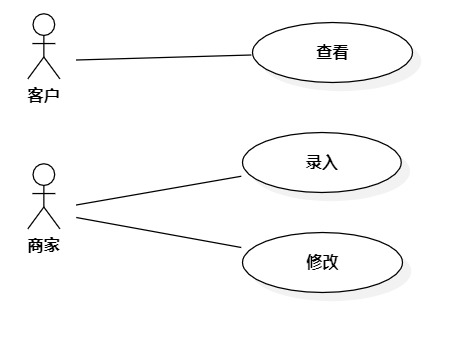

# 实验二:用例建模

## 一、实验目标
- 学习并掌握用例建模的基本概念
- 细化选题
- 绘制用例图
- 编写用例规约
## 二、实验内容
- 分析功能需求
- 使用StarUML创建用例图
- 编写用例规约
## 三、实验步骤
- 明确项目中的功能需求
	1.查看宠物信息
	2.录入宠物信息
	3.修改宠物信息
- 使用StarUML创建用例图
- 描述功能的用例规约
## 四、实验结果

图1 萌宠交易平台用例图
## 表1：查看宠物信息用例规约  

用例编号  | UC01 | 备注  
-|:-|-  
用例名称  | 查看宠物信息 |   
前置条件  |宠物信息存在     | *可选*   
后置条件  |客户查看宠物详细信息     | *可选*   
基本流程  | 1.客户在查询页面输入宠物查询条件并点击查询按钮; |*用例执行成功的步骤*    
~| 2.系统检查查询宠物条件不为空;  |   
~| 3.系统查询宠物信息; |  
~| 4.系统显示宠物信息;   |   
~| 5.客户点击宠物信息详情按钮;   |   
~| 6.系统展示宠物详情信息。  |   
扩展流程  | 2.1系统检查发现查询宠物条件为空，提示“输入为空”; |*用例执行失败*    

## 表2：录入宠物信息用例规约  

用例编号  | UC02 | 备注  
-|--|-  
用例名称  | 录入宠物信息 |   
前置条件  | 商家登录      | *可选*   
后置条件  | 商家进入刚录入宠物信息详情页面  | *可选*   
基本流程  | 1.商家点击录入按钮;  |*用例执行成功的步                                             
~| 2.系统显示录入页面 ;  |   
~| 3.商家输入宠物信息，点击录入按钮;   |   
~| 4.系统检测宠物信息填写完整并且不重复 ，保存录入的宠物信息; |  
~| 5.系统展示刚修改好的宠物详情信息页面 。 | 
扩展流程  | 5.1 系统检测到宠物信息未填写完整，提示“宠物信息未填写完整” ; |*用例执行失败*    
~|  5.2系统检测到宠物信息重复，提示“宠物已存在”;  |  

## 表3：修改宠物信息用例规约  

用例编号  | UC03 | 备注  
-|:--|-  
用例名称  | 修改宠物信息 |   
前置条件  | 商家登录并且宠物信息存在    | *可选*   
后置条件  | 商家进入刚修改好的宠物信息详情页面      | *可选*   
基本流程  | 1.商家点击宠物详情页面中的修改按钮; |*用例执行成功的步骤*    
~| 2.系统展示宠物信息修改页面 ;  |   
~| 3.商家更新宠物信息，点击提交按钮  ; |   
~| 4.系统检测宠物信息填写完整并且不重复，保存修改的宠物信息 ; |  
~| 5.系统展示刚修改好的宠物详情信息页面 。 |  
扩展流程  | 5.1 系统检测到宠物信息未填写完整，提示“宠物信息未填写完整” ; |*用例执行失败*    
~| 5.2 系统检测到宠物信息重复，提示“宠物未修改” |  
