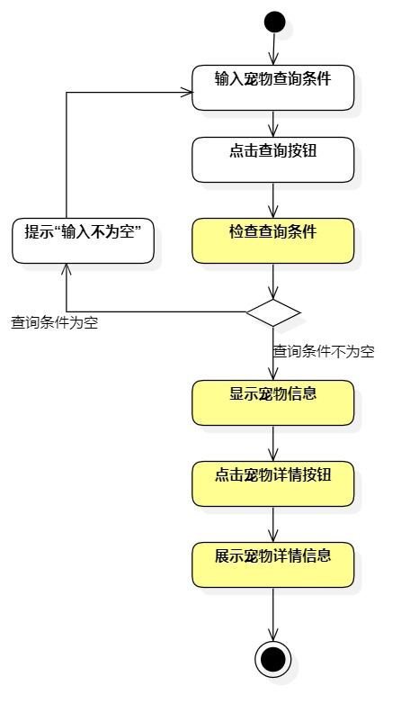
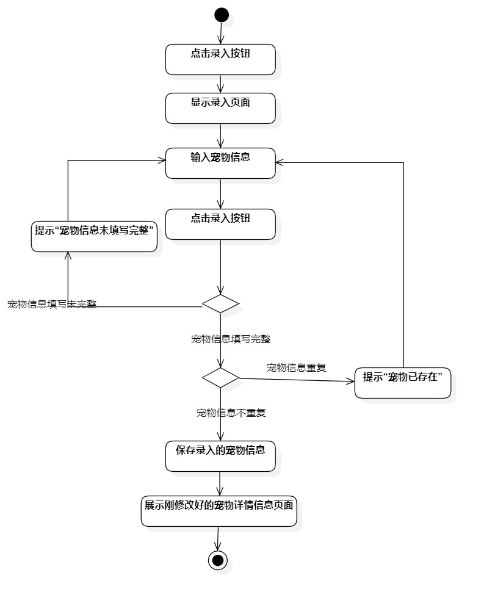
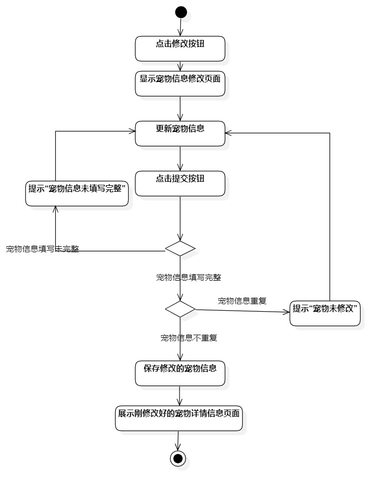

# 实验三:过程建模

## 一、实验目标
- 学习并掌握过程建模的基本概念。
- 绘制活动图（Activity Diagram）。
## 二、实验内容
- 根据用例规约绘制相应的活动图。
## 三、实验步骤
- 在StarUml中创建活动图
	1.查看宠物信息
	2.录入宠物信息
	3.修改宠物信息
- 添加Initial和Final节点
- 根据用例规约绘制绘制活动图
	1.把基本流程和扩展流程的动作画为操作（Action）
	2.分支的操作之后使用决策（Decision）节点。

## 四、实验结果

图1 查看宠物信息活动图

图2 录入宠物信息活动图

图3 修改宠物信息活动图

