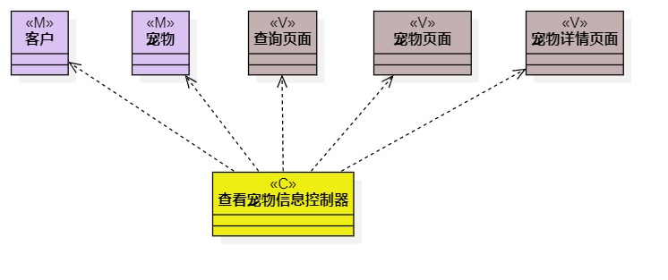
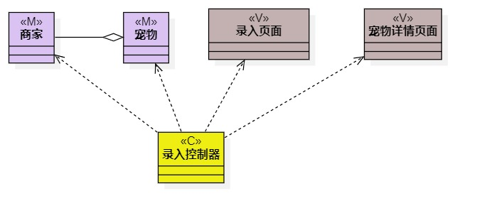
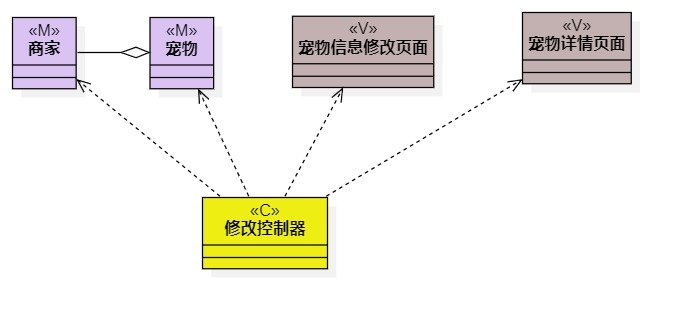

# 实验四:类建模
# 实验五:高级类建模

## 一、实验目标
- 掌握类的概念和构成
- 掌握类建模方法
- 了解MVC设计模式
- 理解类的5种关系
- 掌握类之间关系的画法
## 二、实验内容
- 根据用例规约绘制相应的类图。

   1.查看宠物信息类图

   2.录入宠物信息类图

   3.修改宠物信息类图
## 三、实验步骤
- 在StarUml中创建类图
  1.查看宠物信息
  2.录入宠物信息
  3.修改宠物信息
- 从用例规约中的基本流程和扩展流程中寻找类
- 根据系统操作设计业务服务类
- 根据mvc设计模式确定类的关系
## 四、实验结果

图1 萌宠交易平台查看宠物信息类图

图2 萌宠交易平台录入宠物信息类图

图3 萌宠交易平台修改宠物信息类图