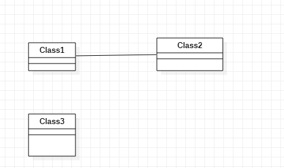

# 实验一

## 一、实验目标

1. 熟悉GitHub实验过程  
2. 安装与使用StarUML  

## 二、实验内容

1. 安装GitHub并练习实验Git Bash  
2. 安装StarUML并创建一个图  

## 三、实验步骤

1. Fork项目  
2. 克隆项目到本地  
3. 在本地创建文件夹及文件  
4. 将文件提交到GitHub  
5. 发送结果到主项目库  
 
## 四、实验结果

1. 画图  

  

图1. 在StarUML创建的第一个图
