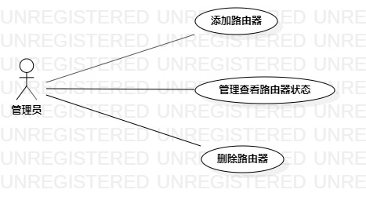

# 实验二：用例建模

## 实验目标

1. 使用Markdown编写实验报告  
2. 完成选题  
3. 用例建模  

## 实验内容

1. 使用Markdown完善实验一报告  
2. 使用StarUML对选题完成建模  
3. 编写实验报告  

## 实验步骤

1. 确定选题：#495 WIFI管家  
  WIFI管家功能如下：  
  1.1 管理员登录后可以添加路由器到管理列表  
  1.2 在管理列表查看路由器的状态  
  1.3 删除管理列表里的路由器  
2. 在Git bash上将创建的lab2.mb上传到个人库  
3. 根据题目在StarUML上创建用例图,将用例图导出到本地库  
4. git push到个人库  
5. 编写lab2.mb，完成实验报告文档  
6. 报告文档git pull到本地库  
7. 提交主库  

## 实验结果

  

图1: WIFI管家的用例图
