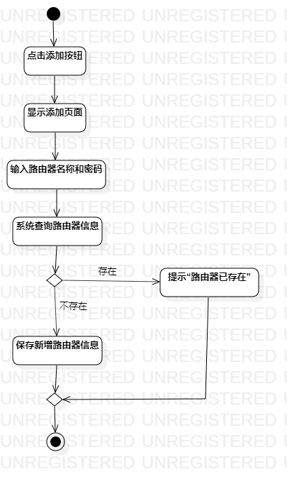
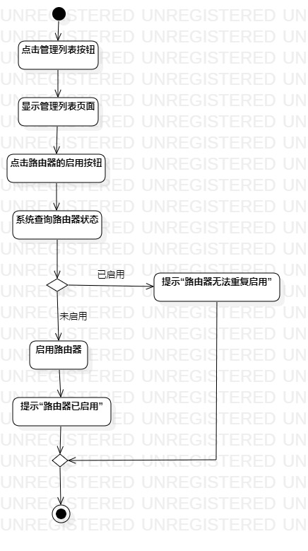
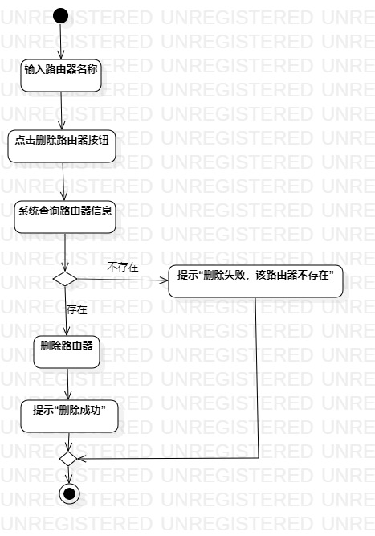

# 实验三:过程建模

## 一、实验目标

1. 学习并掌握过程建模  
2. 掌握活动图的绘制  

## 二、实验内容

1. 学习过程建模
2. 根据用例规约绘制相应的活动图  

## 三、实验步骤

1. 创建三个活动图————添加活动图、启用活动图和删除活动图  
2. 添加Initial和Final节点  
3. 根据用例规约添加Action和Decision节点  
4. 用Control Flow将各节点连接起来

## 四、实验结果

  
图1. 添加路由器活动图  
  
图2. 启用路由器活动图  
  
图3. 删除路由器活动图  
