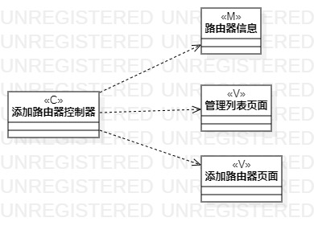
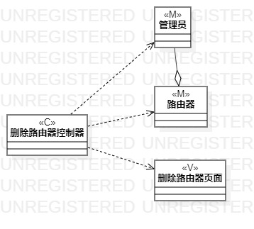

# 实验四：类建模  
  
## 一、实验目标  
  
1. 掌握类建模方法  
2. 了解MVC的设计模式  
3. 掌握类图的画法  

## 二、实验内容  

1. 学习类建模方法  
2. 根据用例规约创建类图  
  
## 三、实验步骤  
  
1. 从用例规约的基本流程和扩展流程中分别找到三个功能的类  
2. 创建添加路由器、启用路由器、删除路由器三个类图  
3. 在类图中添加Control类、View类和Model类  
4. 根据MVC设计模式设计类之间的关系  
5. 用依赖线连接控制器和其他类，使用聚合线连接管理员和路由器  

## 实验结果  
  
  
图1：添加路由器的类图  
  
  
图2：启用路由器的类图  

  
图3：删除路由器的类图  
