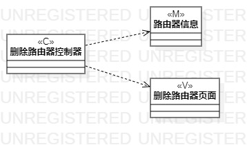

# 实验四：类建模  
  
## 一、实验目标  
  
1. 掌握类建模方法  
2. 了解MVC的设计模式  
3. 掌握类图的画法  

## 二、实验内容  

1. 学习类建模方法  
2. 根据用例规约创建类图  
  
## 三、实验步骤  
  
1. 创建添加路由器的类图  
2. 根据MVC创建四个类，分别是添加路由器控制器、路由器信息、管理列表页面、添加路由器页面  
3. 然后给4个类添加依赖关系  
4. 创建启用路由器的类图  
5. 创建三个类，分别是路由器状态、启用路由器控制器、管理列表页面  
6. 给3个类添加依赖关系  
7. 修改用例规约  
8. 创建删除路由器的类图  
9. 创建三个类，分别是路由器信息、删除路由器控制器、删除路由器页面  
10. 给3个类添加依赖关系  

## 实验结果 
  
  
图1：添加路由器的类图  
  
  
图2：启用路由器的类图  

  
图3：删除路由器的类图  
