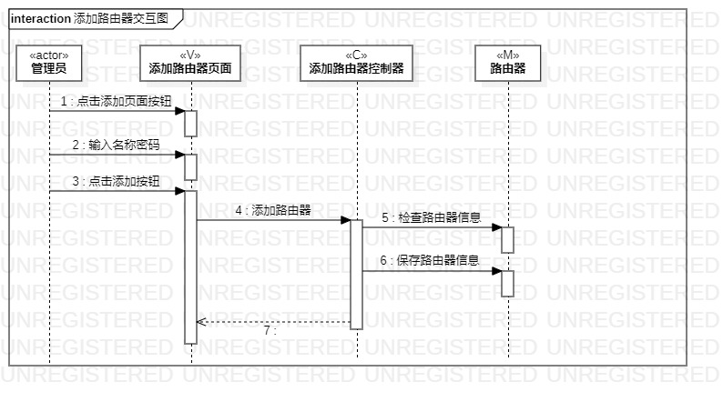
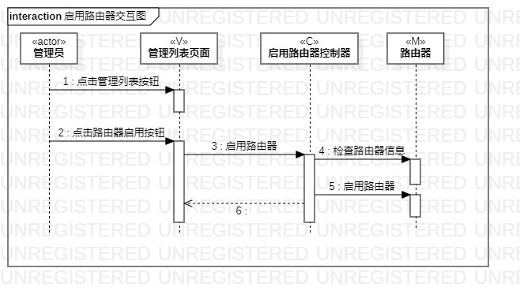
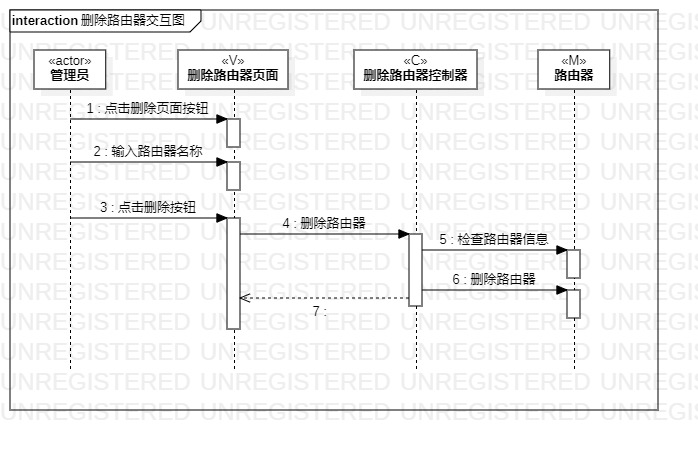

# 实验六：交互建模  
  
## 一、实验目标  
  
1. 学习系统交互  
2. 了解顺序图的概念  
3. 掌握顺序图的画法  

## 二、实验内容  

1. 学习交互建模  
2. 根据活动图和类图创建顺序图  
  
## 三、实验步骤  
  
1. 修改用例规约、活动图、类图  
2. 创建添加路由器交互图  
3. 根据添加路由器类图创建四个Lifeline，根据活动图连接Message  
4. 创建启用路由器交互图  
5. 根据启用路由器类图创建四个Lifeline，根据活动图连接Message  
6. 创建删除路由器交互图  
7. 根据删除路由器类图创建四个Lifeline，根据活动图连接Message  

## 实验结果 
  
  
图1：添加路由器的交互图  
  
  
图2：启用路由器的交互图  

  
图3：删除路由器的交互图  
